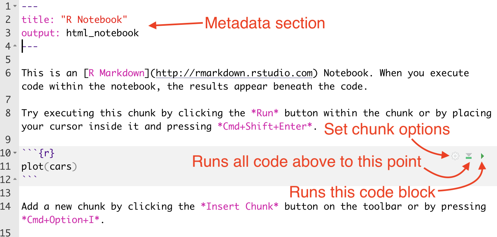

```{r setup, include=FALSE}
library(tidyverse)
library(janitor)
library(learnr)
knitr::opts_chunk$set(echo = FALSE)

deaths <- read_csv("data/chj_mn_opiate_deaths_data.csv")

```


## About these lessons

> These lessons were prepared by Christian McDonald and Andrew Ba Tran. We use Macs so any keyboard commands that are *Cmd+whatever* might be *Ctrl+whatever* on a PC. Some keyboard shortcuts might be different, but you can find them from the appropriate menu item in RStudio.

As we go through this week of training, we will use interactive tutorials like this one to describe and practice key concepts about R and the [tidyverse](https://www.tidyverse.org/). We'll then provide directions on how you can practice similar steps on your own computer using RStudio.

Here is an example exercise to show how you can write R code directly in the browser and run it. Since R is a programming language that allows you to do simple math, we can do so here with common operators like `+`, `-`, `*` and `\`.

### Exercise 

*Here's a simple exercise with an empty code chunk provided for entering the answer.*

Write the R code required to add two plus two. Use the **Hint** button if you need it:

```{r two-plus-two, exercise=TRUE}

```

```{r two-plus-two-hint}
2 + 2
```

You'll see once you put in the answer and click **Run code** the executed answer will appear below the code chunk. 

## Learning RStudio

This first session on the first day we'll be learning about RStudio, R Markdown and how to use them. It's a lot of setup and not a lot of practice. I promise we'll get to the data quickly in future sessions.

With this, you'll be working in RStudio on your computer and then flipping back to this page for the directions.

### Create a chj folder for your work

Before we even launch RStudio, I would like you to create a folder on your computer called `chj` in some place you can find it later, like in your `Documents` folder. Each new data project will have its own folder, and it would be ideal if you could create those for this class inside your `chj` folder. That way we are all on the same page.

> Break for a minute to allow folder creation.

### What is R vs RStudio

While R and RStudio are technically two programs installed on your computer, you will only launch and use RStudio. R is the programming language, and RStudio is an IDE (Integrated Development Environment) -- which is essentially a fancy code editor -- developed specifically for R programming.

There are two main ways to write an R program, either in an R script (files with a `.R` ending) or as an R Notebook (which has an `.Rmd` ending because it is written in R Markdown.) We like using **R Notebooks** because we can interweave our code chunks with text explaining what we are tying to do. This is important as journalists because we want to be transparent about our work. It also helps us remember what the heck we were doing three weeks ago when we last used our code. *Remember, the most important audience of your code is your future self!*

### Launching RStudio

1. Go ahead and launch RStudio if you haven't already.

When you launch RStudio, you will get a screen like this:

{width="90%"}

### Updating preferences

There are some preferences in RStudio that I would like you to change. By default, the program wants to save the state of your work (all the variables and such) when you close a project, but that is not good practice. We'll change that.

1. Go to the **RStudio** menu and choose **Preferences**
1. Under the **General** tab, uncheck the first four boxes.
1. On the option "Save Workspace to .Rdata on exit", change that dropdown to **Never**.
1. Click *OK* to close the box.

{width="90%"}

We only have to do this once for each computer.

### Starting a new Project

When we work in RStudio, we will create "Projects" to hold all the files related to one another. This sets the "working directory", which is a sort of home base for the project.

We will now go through the directions to create a new project. Please follow these steps on your computer.

1. In the top toolbar for RStudio, click on the second button that has a green `+R` sign.
1. That brings up a box to create the project with several options. You want **New Directory** (unless you already have a folder for this specific project, which you don't yet.)
1. For **Project Type**, choose **New Project**.
1. Next, for the **Directory name**, choose a new name for your project folder. For this project, use "first-project".
1. For **Create project as a subdirectory of:** I want you to click on the **Browse** button and go find the `chj` folder you created earlier.

I am pretty anal-retentive about naming folders because they can become URLs in the future. It's a good programming habit.

- Use lowercase characters.
- Don't use spaces. Use dashes.

{width=90%}

When you hit **Create Project**, your RStudio window will refresh and you'll see the `first-project.Rproj` file in your Files list.


## Projects and R Notebooks

You should consider each R project as a self-contained unit. Each R session should run one project at a time. The `first-project.Rproj` file helps RStudio understand this one-project world. Every other file you need for your project should be stored inside your project folder.

For this class, we will almost always use R Notebooks. This format allows us to write text in between our blocks of code. The text is written in a language called [R Markdown](https://R Markdown.rstudio.com/lesson-1.html), a juiced-up version of the common documentation syntax used by programmers, Markdown. It's not hard to learn.

### Create your first R Notebook

1. Click on the button at the top-left of RStudio that has just the green `+` sign with a document behind it.
1. Choose the item **R Notebook**.

This will open a new file with some boilerplate R Markdown code.

{width="90%"}

- At the top between the `---` marks, is the **metadata**. This is written using YAML, and what is inside are commands for the R Notebook. Don't sweat the YAML syntax too much right now, as we won't be editing it often.
- Next, you'll see a couple of paragraphs of text that describe how to use an R Notebooks. It is written in R Markdown, and has some inline links and bold commands, which you will learn.
- Then you will see an R code chunk.

Let's take a closer look at this chunk part:

- The three back-tick characters (the key found at the top left on your keyboard) followed by the `{r}` indicate that this is a chunk of R code. The last three back ticks say the code chunk is over.
- The `{r}` bit can have some parameters added to it. We'll get into that later.
- The line `plot(cars)` is R programming code. We'll see what that commands does in a bit.
- The green right-arrow to the far right is a play button to run the code that is inside the chunk.
- The green down-arrow and bar to the left of that runs all the code in the Notebook up to that point.
- The hard-to-see gear to the left of that allows you to set code chunk options. We probaby won't use that much here.

### Save the .Rmd file

1. Do *Cmd+s* or hit the floppy disk icon to save the file.
1. It will ask you what you want to name this file. Call it `01-first-file.Rmd`. RStudio should already be saving this file inside your project folder.

> We named this file with `01-` at the beginning because we'll often have multiple notebooks in a project that should be run in order. Data created from one notebook might be used in another. Using this convention lets us know what order to run the notebooks.

When you do this, you may see another new file created in your Files directory with an `.nb.html` ending. It's the pretty version of the notebook which we'll see in a minute.

In the YAML metadata portion of the file, give your notebook a better title.

- Replace "R Notebook" in the `title: "R Notebook"` code to be "Christian's first notebook", but use your name.

### Run the notebook

There is only one chunk to run in this notebook, so:

1. Click on the green right-arrow to run the code.

You should get something like this:

{width="90%"}

What you've done here is create a plot chart of the sample data "cars" that is already embedded inside the R programming language. (FWIW, it is the speed of cars and the distances taken to stop, but note the data were recorded in the 1920s.) There are other data sets like this embedded in R for examples like this.

But that wasn't a whole lot of code to see there is a relationship with speed vs stopping distance, eh?

> Let's stop here to make sure everyone has gotten to this point.

### Adding new code chunks

The text after the chart describes how to insert a new code chunk. Let's do that.

- Add a couple of returns after the paragraph of text about code chunks, but before the next bit about previews.
- Use the keys *Cmd+Option+i* to add the chunk.
- Your cursor will be inserted into the middle of the chunk. Type in this code in the space provided:

```r
# update 55 to your age
age <- 55
(age - 7) * 2
```

- Change for "55" to your real age.
- With your cursor somewhere in the code block, use the key command *Cmd+Shift+Return*, which is the key command to RUN ALL LINES of the code chunk.
- NOTE: To run an individual line, use *Cmd+Return* while on that line.

Congratulations! The answer given at the bottom of that code chunk is the [socially-acceptable maximum age of anyone you should date](https://www.psychologytoday.com/us/blog/meet-catch-and-keep/201405/who-is-too-young-or-too-old-you-date).

Throwing aside whether the formula is sound, let's break down the code.

- `# update 53 to your age` is a comment. It's a way to explain what is happening in the code without being considered part of the code. The hashtag at the beginning of the line makes it a comment.
- `age <- 53` is assigning a number (`53`) to a variable name (`age`). A variable is a placeholder. It can hold numbers, text or even groups of numbers. Variables are key to programming because they allow you to change a value as you go along. In R we use an arrow (or dash and angle bracket) to show which direction we are assigning the value, but convention is to name the variable first, then assign from the right.
- Pro tip: You can use *Option+-* (Option dash) to type in the `<-` assigning operator.
- The next part is simple math: `(age - 7) * 2` takes the value of `age` and subtracts `7`, then multiplies by `2`. You might have noticed that the editor helped you by adding closing `)` and putting your cursor in the middle. If you've never used a code editor, help like this can be confusing at first, but you'll learn to love it.
- When you run the code chunck, you get the result of the math equation below it, `[1] 92` in my case. That means there was one observation, and the value was "92". For the record, my wife is _much_ younger than that.

Now you can play with the number assigned to the age variable to test out different ages. Do that.

This is how R Markdown documents work ... you intersperse text and code chunks. When  you run a code chunk, you get the results and messages under the chunk.

> We'll break here to make sure everyone is good.

### A note on R Markdown and clean code

When writing R Markdown in an R Notebook, you want an empty blank line between each major element: code block, headline, or paragraph of text.

In the text, headlines are indicated with one or more hashtags at the beginning with a space before the words. The more hashtags there are, the smaller the headline (I know, it's counter-intuitive, but it matches HTML headlines.) In R Notebooks, the singe-hashtag headline is the Document in the metadata, so the next biggest headline you should use is two hashes:

```md

## This is the biggest headline you should add in R Markdown

This is text.

This is a new paragraph.

### A smaller headline as subhead to the one above

This text is related to the above in some way.

- This is a list item
- This is another list item
  - Nested list items do work if you indent it.
- You need blank lines **above and below** the list.

1. This is an ordered list
1. This is the next item and it will come out as 2.
2. Markdown renumbers the ordered list no matter what number you use.
```

Also make sure you have blank lines above and below each code chunk.

### Preview the report

The rest of the boilerplate text here describes how you can *Preview* and *Knit* a notebook. Let's do that now.

1. Press *Cmd+Shift+K* to open a Preview.

This will open a new window and show you the "pretty" notebook that we are building.

Preview is a little different than *Knit*, which runs all the code, then creates the new knitted HTML document. **Knit to HMTL** creates an HTML document that you can send to others, or publish on Github with some additional YAML configurations. You can also Knit to PDFs.

### The toolbar

One last thing to point out with RStudio before we move on is the toolbar that runs across the top of the R Notebook file window. The image below explains some of the more useful tools, but you _REALLY_ should learn and use keyboard commands when they are available.

{width=90%}

## The tidyverse and R packages

While "base" R is a robust programming language on its own, the true power lies in a community that writes "packages" to do new things easier and better. As R users, we "install" the code for these packages into RStudio to make their functions available to us.

The pièce de résistance of packages is the [tidyverse](https://www.tidyverse.org/), a collection of packages for data science that were all written to work together. Hadley Wickham is one of the main developers. He wrote the book [R for Data Science](https://r4ds.had.co.nz/index.html).

{width=90%}

### Install the tidyverse

Let's install the tidyverse on your machines.

- Open the **Console** at the bottom of your RStudio window.
- At the bottom after the `>` type in `install.packages("tidyverse")` and hit return.

You'll see your computer work away and eventually come to a success message saying where the packages were installed. You only have to do this once for your computer.

When we install packages, we put the package name in quotes because R doesn't "have" what it is looking for yet and has to look for it. When we "use" libraries later, we won't have the quotes.

### Install janitor and lubridate

There are two other packages we are going to install and we'll do it at one time, learning about `c()` along the way.

- In your **Console**, run:

`install.packages(c("janitor","lubridate"))`

[janitor](https://cran.r-project.org/web/packages/janitor/vignettes/janitor.html) has some data cleaning properties we'll use. [lubridate](https://lubridate.tidyverse.org/) makes dealing with date and time values a little easier.

You'll note we used this `c("term1","term1")` construction to feed R a combination of items, which you'll see a lot. The `c` stands for **combine** and we use it to build collections of things we call **vectors**.

> **BORING DETAILS:** [**Vectors**](https://www.tutorialspoint.com/r/r_vectors.htm) are collections of elements of like value, like numbers or strings of letters. Everything is a vector in R, really -- a single letter in R is a vector with a length of 1. Think of vectors like a list of common things, but know a [list](https://www.tutorialspoint.com/r/r_lists.htm) is a special object of its own, a combination of unlike things.


## Example R Markdown document

We now want to walk through a full analysis do you can see the power (and reproducibility) of R.

1. In your same project, create a new **R Notebook** document. (Under the +Document icon).
2. Save the file as `acc-intakes.Rmd`.
3. Delete everything inside.
4. Go go [this URL](https://raw.githubusercontent.com/utdata/chj-r-introduction/main/data-prep/chj-aac/aac-intakes.Rmd) in a browser like Chrome.
5. Copy and paste all the contents and put it in your R Notebook. (You should be able to do **Cmd+a** to select all.)
6. Once you've pasted the code and saved it, do **Cmd+Shift+R** to Run All. (It's also under the Run menu in the toolbar.)

### Austin Animal Center Intakes Analysis

Hopefully your document ran and you should see all the results and plots. This is an example of a well formatted analysis. (If we have time, we'll quickly explain what is going on in the data, etc.)

Here are some things to consider with this example:

- The Markdown is well formatted. There are blank lines between all elements except list items. This is good for readability in the document and for it to knit properly and beautifully.
- There is an explanation at the top of what the document hopes to accomplish. It includes a link to the original data.
- Each major step is broken down into sections with headlines, subheadlines and text to explain what is being done in the code.
- The R code chunks are named. This helps when you use the bookmark menu at the bottom of the Notebook menu. (Easier to show than explain.)
- There are some comments inside the code where they might help the author or others.
- Inside the R chunks, you'll notice that some functions have been split into multiple lines so the arguments are easy to follow. RStudio helps you with this with indenting and such.
- When data is summarized or overwritten, it is assigned to a new R object with `<-`. This way the original data is always available.

## The tidyverse pipe

As you look through the example, you'll notice this character combination ` %>% ` at the end of lines in the code chunks.

The ` %>% ` (or "pipe" as it is called) is one of the core tenets of the tidyverse. The pipe takes the result of the previous operation and "pipes" the result into the next operation. It makes for more readable code than the nested syntax of base R, so much so I don't even teach nesting.

When we see the pipe, think of the term "and then". Here is an example:

```r
intakes %>% 
  head()
```

We are starting with the `intakes` data frame **and then** limiting that result to just the `head()` (or top) of data frame. The default number of lines for `head()` is six but you can specify how many lines you want by putting a number inside the parenthesis, like `head(20)`.

A couple of things about the pipe:

- The `%>%` has to be on the same line of code that is "pushing" from.
- In complicated strings of code, you can add a return *after* the pipe, then the next line will be indented to indicate it is a continuation. So you'll often see a pipe at the end of a line, like in our examples above. (I do this more often than not.)
- In RStudio you can use the keyboard command *Cmd+shift+m* type the pipe. Unfortunately keyboard commands don't work inside the online tutorials.


## R Frequently asked Questions

#### Some R code basics

* `<-` is known as an "assignment operator" -- it means "Make the object named to the left equal to the output of the code to the right"
* `&` means AND, in Boolean logic
* `|` means OR, in Boolean logic
* `!` means NOT, in Boolean logic
* When referring to values entered as text, or to dates, put them in quote marks like this: `"United States"`, or `"2016-07-26"`. Numbers are not quoted
* When entering two or more values as a list, combine them using the function `c`, for combine, with the values separated by commas, for example: `c("2017-07-26", "2017-08-04")`
* As in a spreadsheet, you can specify a range of values with a colon, for example: `c(1:10)` creates a list of integers (whole numbers) from one to ten.
* Some common operators:
	* `+` `-` add, subtract
	* `*` `/` multiply, divide
	* `>` `<` greater than less than
	* `>=` `<=` greater than or equal to, less than or equal to
	* `!=` not equal to
* **Equal signs can be confusing**
	* `==` tests whether the objects on either end are equal. This is often used in filtering data
	* `=` makes an object equal to a value, which is similar to `<-` but used within a function.
* Handling null values:
	* Nulls are designated as `NA`
	* `is.na(x)` looks for nulls within variable `x`.
	* `!is.na(x) looks for non-null values within variable `x`

Here, `is.na()` is a **function**. Functions are followed by parentheses, and act on code/data in the parentheses.

*Object and variable names in R should not contain spaces*

-----

#### R Workspace

* Your current R working environment
* Includes any user-defined objects (e.g. vectors, data frames, functions)

| Function | Action |
| ------ | -------------------------------------------------- |
| `getwd()`   | List current working directory |
| `setwd("mydirectory")` | Change the current working directory to my directory |
| `ls()`    | List the objects in the current work space |
| `rm(object)`    | Delete object |
| `save(objectlist, file="myfile)`    | Save specific objects to a file |
| `load("myfile")`    | Load a work space into the current session (default = .RData) |

-----

#### Packages

* Collections of R functions, data, and compiled code in well-defined format
* Massively extend the functionality of R
* Thousands of user-written packages on CRAN
	* [https://cran.r-project.org/web/packages](https://cran.r-project.org/web/packages/)


*Mac users may need to alter their security preferences to allow apps authored by non-Apple developers to install. If you notice an error, try to change [your system preferences](https://www.youtube.com/watch?v=xFpVqkyXFy4).*

-----

#### Getting Help

| Function | Action |
| ------ | -------------------------------------------------- |
| `help.start()`   | General help |
| `help("foo")` or `?foo` | Help on function foo (the quotation marks are optional) |
| `help.search("foo")` or `??foo`    | Search the help system for instances of the string foo |
| `example("foo")`    | Examples of function foo (the quotation marks are optional) |

-----

### Working with Packages

* install.packages("*packagename*")
* update.packages()


* library(*packagename*)
* help(package="*packagename*")


* library() #what packages are in the library
* search() #what packages are loaded


## Common Mistakes

* **Using the wrong case**
	* help(), Help(), and HELP() are three different functions (and only the first one will work)
* **Forgetting to use quotation marks when they are needed**
	* install.packages("gclus") will work, while install.packages(gclus) will generate an error.
* **Forgetting to include the parentheses in a function call**
	* help() rather than help. Even if there are no options, you still need the().
* **Using the `\` in a path name on Windows**
	* R sees the backlash character as an escape character.
	* `setwd("c:\mydata")` will generate an error. Use `setwd("c:/mydata")` or `setwd("c:\\mydata")` instead
* **Using a function from a package that is not loaded**
	* For example: The function `str_trim()` is contained in the **stringr** package. 
	* If you try to use it before loading the package, you will get an error

## Getting help

Our example used a ton of R "verbs" as we call the functions ... probably too many to remember, and there are more to come. Let's talk briefly about how you can get help with how things work in R.

One way is through the built-in **Help** function within RStudio. If you look at the pane at the bottom-right of RStudio, you'll see tabs for "Files", "Plots", "Packages" and "Help". Click on the **Help* tab.

You can type in a function or part of a function and get a list of items. If you search for "count" and hit return you'll get documentation on how to use it. It takes some getting used to in reading the docs, but the examples at the bottom are often useful.

### Good Googling

Another way to get help is to Google for it, but that can be an art, especially since there are other data science languages and programs with similar terms as R. Some tips:

- Use "in R" in your search: *How to merge data frames in R*
- Use the name of the package if you now it: *Add labels with ggplot*
- Use "tidyverse" if appropriate: *convert text to date with tidyverse*

There are plenty of Stack Overflow answers along with different tutorials from blogs and such. It is a well-used language, so there are lots of answers to help. Too many, sometimes.

### Tidyverse docs and cheatsheets

It is worth becoming familiar with the [tidyverse](https://www.tidyverse.org/) site. Click on each icon from the home page to learn what each package does. R is also big on [cheatsheets](https://rstudio.com/resources/cheatsheets/), which are printable pages that go through all the verbs. They can be a bit much at first, but useful once you use R more.

We'll try to put together a list of other resources and tutorials. You can find some [I've collected already hxere](https://docs.google.com/document/d/1slMdrTLfxYt0mZO1G_Wlz1cOcGjCdgiJr7wzpcU9n1Y/edit?usp=sharing).

---

We'll end here for this session.

