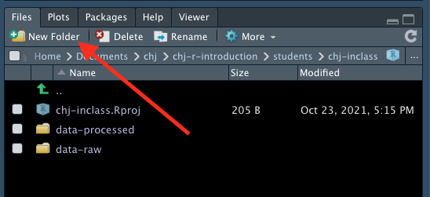
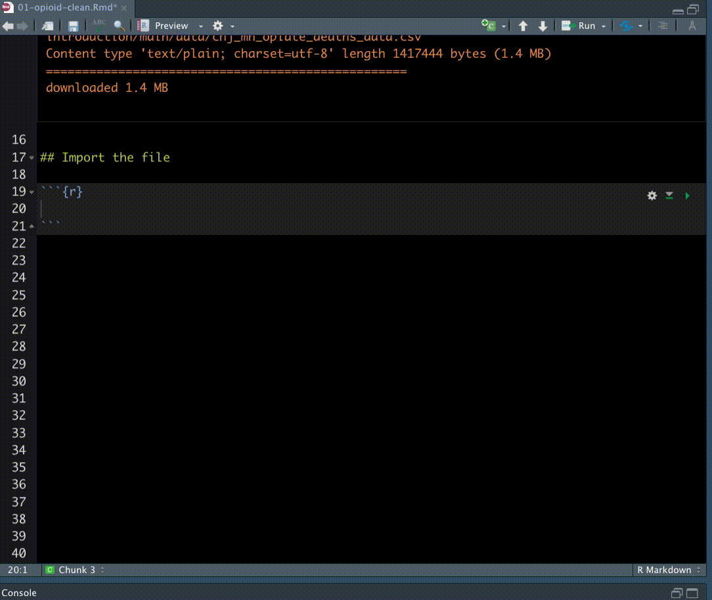
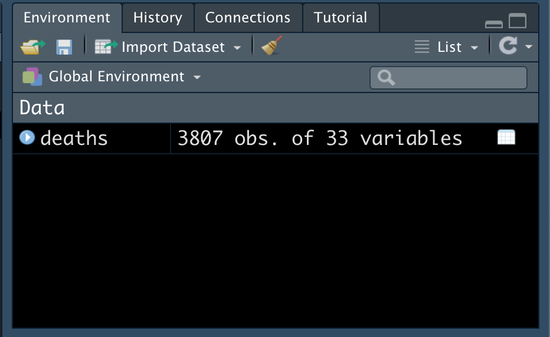

```{r setup, include=FALSE}
library(tidyverse)
library(janitor)
library(learnr)
library(lubridate)
library(readxl)
knitr::opts_chunk$set(echo = FALSE)

# deaths <- read_csv("data-raw/chj_mn_opiate_deaths_data.csv") %>% clean_names()
# 
# deaths_clean <- deaths %>%
#   mutate(
#     birth_clean_date = birth_date %>% mdy(),
#     death_clean_date = death_date %>% mdy(),
#     injury_clean_date = injury_date %>% mdy(),
#   )

```

In this section we'll cover:

- Managing your project
- Setting up libraries
- Importing and exporting data

## Managing your project

Typically you create an new R project for each "subject" you are working on. You might use more than one dataset and have multiple notebooks, but they should all be related.

(We'll break that convention today by mixing unrelated data, but our "subject" here is to learn about importing data so it is all kinda related.)

We want to be careful not to overwrite our original data, so I create a folder to keep all original data and then another to hold all the data files I create. This might be a little anal-retentive, but that is a good trait for a data journalist.

I will often have a separate R Notebook to download and clean data vs analyzing or visualizing data. You may not want to re-download data every time you re-run your notebook, and you'll do that a lot. You also might have multiple analysis notebooks that focus on different things. Separating the download/cleaning steps means you only have to do that part once.

### In RStudio: Start a new project

We'll now set up a new project and R Notebook and load some libraries.

1. Make sure you have RStudio open, but close any open projects using File > Close Project. Save your work if asked.
1. Select the second toolbar icon +R to create a new project (Or File > New project).
1. Choose **New Directory**, then **New Project**.
1. For the directory name, call it `chj-imports`.
1. You shouldn't have to update the "subdirectory of" part, but if you do you should **Browse** to the `chj` folder we created earlier and set that.

This will create a new R project. Now, within this project we will create folders for our data.

1. In the **Files** pane at the bottom-right of RStudio, click on the **New Folder** button.
2. Create a folder called `data-raw`. It should default to save in your `chj-imports` project folder.
3. Create another folder called `data-processed`. Again, it should be in your project folder.



### In RStudio: Start up a notebook

- In the first top toolbar icon with the `+` and document, choose R Notebook.
- In the YAML at the top of the file, change the metadata **title** to "MN Opioid deaths" as that is what we'll be working with.
- Delete everything after the `---` on the 4th line.
- Save the file and name it **01-opioid-clean.Rmd**. (We named with `01-` since this is also the first in a series of notebooks that may work together.)

## Using libraries

In the first lesson, we used the `install.packages()` function in our Console to install three "packages" onto our computer: tidyverse, lubridate and janitor. These packages included "libraries" of functions that help us with certain talks, like working with dates. We ran the install in our Console instead of our R Notebook because we only need to do it once for our computer. When you install a package, you put quotes around the name: `install.packages("lubridate")`.

To _use_ those packages, we have to load them as a "library" in each R Notebook we create. These are typically the first code chunk in a notebook because you can't use a function from one until it is loaded.

### In RStudio: Set up your libraries

When you load the library, you do NOT put quotes around the name. Let's add our library chunk.

1. Make sure you have a full blank line after the YAML metadata and add a new code chuck with *Cmd+Option+I*.
1. Inside this code chunk we add the tidyverse and janitor libraries
2. Inside the top of the chunk `{r}` add a name to the chunk like this: `{r setup}`

Your file should look like this:


```{r}
library(tidyverse)
library(janitor)
```

When you run that chunk of code, you might see this output in your Console:

```r
> library(tidyverse)
package ‘tidyverse’ was built under R version 4.0.2Registered S3 methods overwritten by 'dbplyr':
  method         from
  print.tbl_lazy     
  print.tbl_sql      
── Attaching packages ─────────────────────────────────────────────── tidyverse 1.3.0 ──
✓ ggplot2 3.3.1     ✓ purrr   0.3.4
✓ tibble  3.0.1     ✓ dplyr   1.0.0
✓ tidyr   1.1.0     ✓ stringr 1.4.0
✓ readr   1.3.1     ✓ forcats 0.5.0
── Conflicts ────────────────────────────────────────────────── tidyverse_conflicts() ──
x dplyr::filter() masks stats::filter()
x dplyr::lag()    masks stats::lag()
> library(janitor)

Attaching package: ‘janitor’

The following objects are masked from ‘package:stats’:

    chisq.test, fisher.test

```

The "tidyverse" package is really a collection of libraries: readr, dplyr, tidyr, stringr, ggplot2 and others. You could load those as libraries separately, but I typically load all of `library(tidyverse)`.

## Importing data

OK, let's get to some data, shall we?

### Importing with readr

The tidyverse package [readr](https://readr.tidyverse.org/) (included in the tidyverse library) is our workhorse for importing and exporting of data. There are other tidyverse specialty packages for importing and working with data like [jsonlite](https://cran.r-project.org/web/packages/jsonlite/vignettes/json-aaquickstart.html) and [readxl]([readxl](https://readxl.tidyverse.org/reference/read_excel.html)) and some alternatives like  [rio](https://www.rdocumentation.org/packages/rio/).

The code below shows the `read_csv` function and runs it so you can see the data.

```{r opioid-read, exercise=T}
read_csv("https://raw.githubusercontent.com/utdata/chj-r-introduction/main/data/mn_opiate_short.csv")
```

When we use `read_csv()` and give it a path (in quotes), R will print the result below the R chunk. You can click on the arrows and page navigation to peek through the data. In this case, the _path_ is to a small file on the internet. If we were to import a file from our own computer, we would put in a path relative to project directory, perhaps:

```{r read_fake, exercise = F, echo=T, eval=F}
read_csv("data-raw/chj_mn_opiate_deaths_data.csv")
```

But all this does is print the data to our screen. For us to be able to use this data later, we need to assign it to an R object. A table like this in R is called a **data frame** or (**tibble** as they are known in the tidyverse). We use the `<-` assignment operator to assign the data to the object, which we name ourselves.

We are going to assign the result of the `read_csv()` command into an object called `deaths`. We **name the new object first** then "fill" it with the data. This takes a bit getting used to, but it makes for more readable code down the line. Go ahead and run the code and then we'll talk about it.

> For our tutorial examples, we have to import our files direct from the internet. When you do this on your own, you'll access the relative path like outlined above.

```{r opioid-assign, exercise=T}
# read and assign the data
deaths <- read_csv("https://raw.githubusercontent.com/utdata/chj-r-introduction/main/data/mn_opiate_short.csv")

# peek at the result
deaths %>% head()
```

Let's break this down:

- Line 1 is a comment. We put comments in code when it will help our future selves or others understand it better.
- On line 2 we start by naming our new R object: `deaths`.
- Continuing on line 2, we see the assignment operator ` <- ` so we know whatever comes next is getting put into `deaths`.
- Lastly on line 2 we have the `read_csv` function which has one argument, the path to a csv file on the internet.

If we run this chunk with those two lines, we would save all the content into `deaths`, but we wouldn't be able to see it, so call it to print the top of the tibble to the screen.

- On line 4 we have another comment to say what we are doing
- On line 5 we start with `deaths`, which would print all rows to the screen.
- So we use the pipe ` %>% ` to take the result of `deaths` and push it into `head()`, which gives us the top six lines of data.

### Cleaning up names

One thing you might notice in the column above is some of the column names are two words. While it is possible to keep working this way, it is much easier if all our column names are lowercase and multi-word names are connected with underscores `_`.

We'll "clean" our column names using a function in the [janitor package](http://sfirke.github.io/janitor/) called `clean_names()`.

As we do this it illustrates another point: While our code chunks may end up being multiple lines, we _build_ them one line at a time, often editing to make additional changes.

```{r opioid-clean, exercise=TRUE}
# clean the names and then reassign
deaths <- read_csv("https://raw.githubusercontent.com/utdata/chj-r-introduction/main/data/mn_opiate_short.csv") %>%
  clean_names()

# peek at the top of the updated data frame with head()
deaths %>%
  head()
```


### In RStudio: Download and Import deaths

In RStudio on your computer, we are doing to use the concepts we talked about above to download the full csv dataset to your computer and then import it into your notebook.

We will use the [`download.file()`](https://www.rdocumentation.org/packages/utils/versions/3.6.2/topics/download.file) function to get our opioids death file from the internet and save it into your `data-raw` folder. The function takes two arguments:

- The path to the file you are downloading.
- The path and file name where you are saving the data.

1. Go into your own `01-opioid-deaths.Rmd` RNotebook and add a Markdown headline that you are downloading data. Like this: `## Downloading opioid deaths data`. Make sure you have blank lines above and below the headline.
2. Use **Cmd+Option+i** to add a new code chunk
3. Insert the following code and run it, then I'll explain it.

```{r opioid-download, echo=T, eval=F}
download.file(
  "https://raw.githubusercontent.com/utdata/chj-r-introduction/main/data/chj_mn_opiate_deaths_data.csv",
  "data-processed/opioid_deaths.csv"
)
```

Note I split the arguments into their own lines. This can help readability of the code.

Now that the file is on your computer, we'll import it from there.

I ask that you *type* the code below instead of copy/paste so you can get used to using tab completion for functions and paths, *Cmd+shift+m* for the pipe and *Cmd+-* for the assigning operator. You'll also make mistakes and have to fix them. It helps the learning process.

Work this out one part at a time so you see how the process happens:

1. First get `read_csv()` working to your file.
2. Then add the `clean_names()` function and run it again.
3. Then assign it to `deaths` and pipe it into `head()` and run it.

```{r your_project, eval=F, echo=T}
deaths <- read_csv("https://raw.githubusercontent.com/utdata/chj-r-introduction/main/data/mn_opiate_short.csv") %>%
  clean_names()

deaths %>% head()
```


Here is what it looks like when I'm working this out. I use my **tab** and arrow keys to autocomplete function names and paths. I'm using keyboard shortcuts for pipes and assignments.




Now that you have the code, above the code chunk, write text in your own words to describe what is happening in the code chunk. These kind of annotations are as important to your future self as anyone else.

When you assign the data to the `deaths` data frame, you'll notice that the object shows up in your **Environment** tab at the top right of RStudio. Any object you create is "saved" into the environment to use later.

{width=60%}

> Take a break here to let everyone catch up.

## Exploring data

```{r prep-explore, include=FALSE, warning=F, message=F}
deaths <- read_csv("https://raw.githubusercontent.com/utdata/chj-r-introduction/main/data/mn_opiate_short.csv") %>% clean_names()
```

OK, now we have data imported, but what is in it?

### Glimpse

When we print a tibble to the screen, it gives us an good idea of our data looks like, but you have to click through the columns to see all of them. That can be annoying with lots of data.

A handy way to see all your columns, data types and some examples data is through `glimpse()`. 

```{r explore-glimpse, exercise=T, exercise.setup = "prep-explore", message=F}
deaths %>% glimpse()
```

One thing `glimpse()` is useful for is to see if all your data types are correct. If you browse through this list looking at the data types and example values, is there anything out of whack? Are all the numbers really numbers? Are the dates really dates?

We can see here we have `birth_date` and `death_date` which are stored as <chr> (text) instead of a real date datatype. We'll fix that tomorrow.

### Summary stats

Another way to peek at your data and get some basic stats is with `summary()`.

```{r explore-summary, exercise=T, exercise.setup = "prep-explore", message=F}
deaths %>% summary()
```

For each column you'll see the data type and some other data. Look specifically at `age_years` which is a number data type. The summary gives you some basic stats about the collection of numbers in that column.

The Min and Max values can also be useful, telling you the earliest and latest dates of your data. But we can't see that here because our `birth_date` and `death_date` columns are not yet real dates.

### In RStudio: Explore your data

In your notebook:

1. Add an R chunk to glimpse your full data set
2. Add another chunk to get summary statistics.
3. After inspecting the results, write in Markdown any notes about what you might need to fix in this data.

After you have added the above, you can close this notebook but don't close the project. We'll return to this notebook in a latter lesson.

We'll start a new notebook here directly.

## Importing Excel

As noted when we started this session, you can import data from any number of formats and there are some packages/libraries specific to the type of data you are importing. Since journalists often get data in Excel, we'll explore the [readxl](https://readxl.tidyverse.org/) library.

Since readxl is part of the tidyverse, it works similar to other packages.

The function to import  is `read_excel()` can take a number of arguments:

- The first argument (required) is the path to the file. This is in quotes.
- `sheet = ` is an optional argument to name which sheet to pull from the document. The default is the first sheet.
- `col_types()` is a method to specify the data type upon import. `read_excel()` will guess those types but sometimes it is wrong. Especially true with things like ZIP codes and number-based IDs. We can either set _all_ the columns to one type (text is the safest) or we can specify each column. We can use "guess" and "skip" if it is useful to us. [See documentation](https://readxl.tidyverse.org/articles/cell-and-column-types.html).

You can also [specify cell ranges](https://readxl.tidyverse.org/articles/sheet-geometry.html) and such.

We'll run an example here, then have you try it.

```{r read-excel, exercise = T}
read_excel("https://raw.githubusercontent.com/utdata/chj-r-introduction/main/chj-day1-p2/data-raw/APD_marijuana_arrests_2016-2020_data.xlsx")
```

## Other importing packages

[rio](https://cran.r-project.org/web/packages/rio/vignettes/rio.html) is a package/library designed to simplify importing and exporting data. We are going to stick with the tidyverse readr and readxl libraries, but rio is worth exploring.

There are also packages developed for specific Application Programming Interfaces (APIs) like the U.S. Census bureau ([tidycensus](https://walker-data.com/tidycensus/index.html), [censusapi](https://www.hrecht.com/censusapi/), [tigris](https://github.com/walkerke/tigris)) or [Socrata](https://github.com/Chicago/RSocrata).


