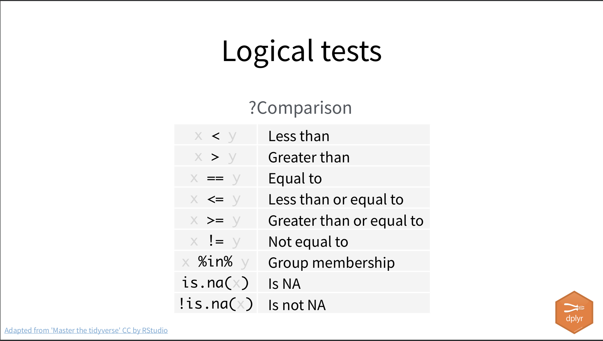
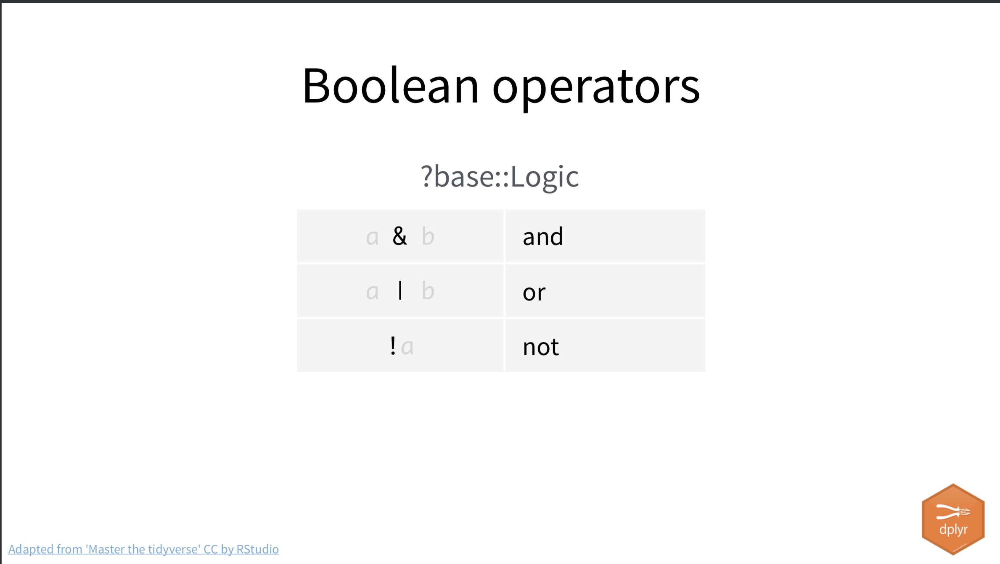

```{r setup, include=FALSE}
library(tidyverse)
library(janitor)
library(learnr)
library(lubridate)
knitr::opts_chunk$set(echo = FALSE)

deaths <- read_csv("chj_mn_opiate_deaths_data.csv") %>% clean_names()

deaths_clean <- deaths %>% 
  mutate(
    birth_clean_date = birth_date %>% mdy(),
    death_clean_date = death_date %>% mdy(),
    injury_clean_date = injury_date %>% mdy(),
  )

```

## Our goals for the day

This lesson was written by Christian McDonald. I use a Mac so any keyboard commands that are *Cmd+whatever* might be *Ctrl+whatever* on a PC.

About 80% of data journalism consists of these basic data concepts:

- Selecting columns
- Filtering data
- Sorting data
- Calculating new data
- Summarizing data (counting and summing)

I have a [series of videos](https://vimeo.com/showcase/7320305) that explain some of these basic concepts that you might want to watch when you have time.

We'll do all that here in day 2, mostly using functions from the [dplyr](https://dplyr.tidyverse.org/) package from the tidyverse.

## Set up a new project

Even though we are starting with data we used yesterday, let's start a new project so you get more practice doing that:

- Launch RStudio
- If you still have yesterday's project open go to **File > Close project**.
- Use the second toolbar button with the `+R` icon to start the New Project Wizard.
- Choose **New Directory** as you'll be creating a new working directory.
- Select **New Project**.
- Name the project `day2-wrangling` and make sure it is still saving to your `chj` folder. Click the **Create Project** button.
- Use the first `+ Document` toolbar icon to start a new **RNotebook**.
- Update your metadata **title** to "Data wrangling".
- Save the file as `01-opioid.Rmd`.
- Remove the boilerplate text BELOW the metadata.
- Insert a code chunk with *Cmd+Option+i* and add the following libraries:

```r
library(tidyverse)
library(janitor)
library(lubridate)
```

- Add some Markdown text explaining that you are importing. To save time, you can copy/paste this:

```text
## Import and clean

This is data of opioid deaths in Minnesota.

```

- Add an other R chuck with *Cmd+Option+i* and add the following inside the chunk:

```r
deaths <- read_csv("https://github.com/utdata/chj-r-introduction/blob/main/data/chj_mn_opiate_deaths_data.csv?raw=true") %>% clean_names()

deaths %>% head()
```

- Now run all the code in your workbook using *Cmd+Option+r*, or go under the **Run** menu at the top-right of the notebook and select **Run all**.

This should load your libraries and run the code to create our data frame.

## Select columns

The `select()` function allows you to select or exclude columns from your data. This code block is already run and assumes the `deaths` data frame has been created.)

```{r deaths-select, exercise=T, exercise.eval=T}
# select columns in deaths
deaths %>% 
  select(first_name, last_name, gender, race)
```

In the `select()` function I just named the columns I wanted to keep.

While we'll just glance at all the nuances here, there are [other selection helpers](https://dplyr.tidyverse.org/reference/select.html) you can use within `select()`. Guess what the next code block will do and then run it.

```{r deaths-select-endswith, exercise=T}
deaths %>% 
  select(ends_with("_date")) %>% 
  head()
```
### On your own

In your project:

- Create a new code chunk.
- Use `select()` to choose some interesting columns to look through in the data.
- Use Markdown text above the code chunk to explain what you've done.

> Break for a minute to do the activity.

## Filtering data

When you want to capture specific rows in your data based on a value in one or more column, you use [filter()](https://dplyr.tidyverse.org/reference/filter.html).

Read the code block below and guess what it might do, then run the code chunk. I also add a select to show a selection of columns.

```{r deaths-filter, exercise=T}
deaths %>% 
  filter(gender == "M") %>% 
  select(ends_with("name"), gender) %>% 
  head()
```

### Filter operators

Note that to match a specific value in the `filter()` equation, you need two equal signs: `==`, and the match has to be in quotes. Here are the other logical tests you can use:

{width=90%}

### Filtering practice

- Write a filter to get only records where the `age_years` is less than 18-years-old and then select only the name and age columns in the result. We've started you off with the `deaths` data frame.

```{r try, exercise=T, exercise.line = 8}
deaths
```


<div id="try-hint">
```r
deaths %>% 
  filter(age_years < 18) %>% 
  select(ends_with("_name"), age_years)
```
</div>

### Common mistakes with filter()

#### Use two == signs for “true”

<p style="color:red">Don't do this:</p>

```r
deaths %>% 
  filter(res_county = "CASS")
```

<p style="color:green">Instead do this:</p>

```r
deaths %>% 
  filter(res_county == "CASS")
```

#### Forgetting quotes

<p style="color:red">Don't do this:</p>

```r
deaths %>% 
  filter(county == CASS)
```

<p style="color:green">Instead do this</p>

```r
deaths %>% 
  filter(county == "CASS")
```
  
### Combining filters

You can filter for more than one thing at a time by separating more than one test with a comma.

```{r filter-multi, exercise=T, exercise.eval=T, exercise.lines=6}
deaths %>% 
  filter(
    gender == "M",
    manner_death == "ACCIDENT"
  ) %>% 
  select(last_name, gender, manner_death)
```

Note that I broke up the filter into multiple lines to make it easier to read and understand. This is easy to do in RStudio because it helps you indent the lines properly, unlike the learning environment here.

When you use a comma to separate tests, it becomes an AND statement and both tests have to be true. If you want OR, then you use a pipe character `|`. (It's the shift-value of the backslash key on your keyboard, usually above Return. Not-but-will-be-confused with the tidyverse pipe ` %>% `.)

I put this on one line so you can see both sides of the filter equation together.

```{r filter-or, exercise=T}
deaths %>% 
  filter(manner_death == "HOMICIDE" | manner_death == "PENDING INVESTIGATION") %>% 
  select(manner_death)
```

Note you have to repeat the column name for each test, even if it is another rule on the same column.

I'll show you one more operator called `%in%` because I find it particularly useful: Finding rows within a list of values. This gets the same result as the code above, but is easier to write and understand.

```{r filter-in, exercise=T}
deaths %>% 
  filter(manner_death %in% c("HOMICIDE", "PENDING INVESTIGATION")) %>% 
  select(manner_death)
```

Note I use the `c()` construction again to combine several values into a vector to search through. I'll often save my list of items into variable, and then filter with that. Again, this does the same as above, but just extrapolates the list:

```{r filter-list, exercise=T, exercise.eval=T}
manners_list <- c("HOMICIDE", "PENDING INVESTIGATION")

deaths %>% 
  filter(manner_death %in% manners_list)
```

Here are the operators to combine filters:

{width=90%}

### Filter on your own

In your own project:

- Start a new R chunk and filter to find cases of "African American" women.
- Write some Markdown text above the chunk explaining what you are doing in the code.

> We'll break here for three minute to try that.

## Sorting data

The tidyverse verb for sorting data is `arrange()`. We'll introduce it quicky here, but use it more later.

```{r arrange, exercise=T}
deaths %>% 
  arrange(age_years) %>% 
  select(age_years)
```

To get a column to sort in descending order, I add ` %>% desc()` to the column value. (Another way to do it is `arrange(desc(age_years))` but I like using the tidyverse pipe as it is more readable.)

```{r arrange-desc, exercise=T}
deaths %>% 
  # arrange descending order using the tidyverse pipe
  arrange(age_years %>% desc()) %>% 
  # select just to see the result. An opioid death at 98?
  select(age_years, manner_death)
```

You can sort by more than one column using a comma between rules within the `arrange()`.

## Calculating or updating data

The verb to change data in your data frame is [mutate()](https://dplyr.tidyverse.org/reference/mutate.html). You can use this to calculate new column of data based on other columns, or to replace data with a mutation of the original.

We'll use `mutate()` to convert our text-based dates to a real datetime object. We'll be using the [lubridate](https://lubridate.tidyverse.org/) package to help us, but we installed it yesterday and included it in the libraries at the top of our project.

### Using mutate to convert dates

We'll show this first in this learning environment before fixing the data in your project.

```{r convert-date, exercise=T}
deaths %>% 
  mutate(
    # creates new date column
    birth_clean_date = birth_date %>% mdy()
  ) %>% 
  # just to show the new/old cols
  select(birth_date, birth_clean_date)
```

I put the value inside the `mutate()` on a line by itself to make it clearly readable what we are doing. I can do multiple mutations by adding a comma and return after line 4 and adding another rule. I also put the `_clean_` part of the name in the middle so we can still use `ends_with("_date")` within our selects.

Let's break this down a little:

- Within the mutate call, we name the new column first (`birth_clean_date`) and then "fill" it with the right side of the equation. If we wanted to update the existing column, we would use `birth_date` on the left side of the equation, too, but that can be risky because you want to see what the mutation is doing vs the original data in case anything goes awry.
- On the right side of the equation we are starting with the column we want to convert, `birth_date` but then use a pipe` %>% mdy()` to convert that value.
- The `mdy()` part on the right side tells lubridate what order the date values are in. If we were starting with 1992/7/18, then we would use `ymd()`.

BORING DETAIL: You might see this written elsewhere as `mutate(birth_date_clean = mdy(birth_date))`, where the column you are converting is inside the `mdy()` function. I like the tidyverse notation using the pipe because nested rules can get confusing if there are more than one. Others may disagree, but they didn't write this tutorial.

### Calculate a new column with math

We don't have two number columns in our opioid data, so here is an example of creating a new column using math from the `mtcars` data set of automobile statistics. We are creating a "horsepower per cylinder", which is probably not a real thing. Again, the `mutate()` step names the new column first on the left side equation, then sets the result of the right side of the equation for each row.

```{r mtcars-math, exercise=T, exercise.eval=T}
mtcars %>% 
  mutate(
    hp_cyl= hp/cyl
  ) %>% 
  select(hp, cyl, hp_cyl)
```

### Mutate on your own

In your own project, use the convert dates example above to write a mutate rule to convert all three date columns in `deaths` into new "_clean_" columns, but  **assign the result back into a new data frame called `deaths_clean`**. _After_ you've reassigned the data frame, print the `deaths_clean` data frame and pipe in into a `select()` to show all six date columns so you can compare them.

I want you to do this in your own project in RStudio because it is easier to write code there than in this learning environment, but I include a practice session below with a hint in case you have trouble.

```{r convert-date-practice, exercise=T, exercise.lines=10}
deaths
```

<div id="convert-date-practice-hint">
```r
deaths_clean <- deaths %>% 
  mutate(
    birth_clean_date = birth_date %>% mdy(),
    death_clean_date = death_date %>% mdy(),
    injury_clean_date = injury_date %>% mdy()
  )

deaths_clean %>% 
  select(ends_with("_date"))
```
</div>

- After you've written and tested your code, write a Markdown annotation above it explaining the code.

## Summarizing data

Summarizing data in R typically takes two steps: 1) Group the rows based on some value in the data, 2) Aggregate those groups by counting the rows or doing math on values.

The Group and Aggregate combo can be confusing. We'll watch the video below to get a visual understanding of the concept. It's part of a series on [Basic Data Journalism Function](https://vimeo.com/showcase/7320305).


The verbs we use in R are [group_by](https://dplyr.tidyverse.org/reference/group_by.html) and [summarize](https://dplyr.tidyverse.org/reference/summarise.html).

BORING TIDBIT: Hadley Wickham is from New Zealand, so there are both the Queen's English `summarise()` and Americanized `summarize()` functions, but they do exactly the same thing. Unfortunately for Americans, summarise arrives first in alphabetical order in type-assist.

### Basic group and sum

When we group and sum, we are usually counting records or doing math on a value. We only have one number in our data, so we'll start with that.

**THE QUESTION:** What is the average and median age of the deaths by gender?

Read the code and guess how it works, then run it and then we'll walk through it line-by-line.

```{r group-mean, exercise=T}
deaths_clean %>% 
  group_by(gender) %>% 
  summarize(
    avg =  mean(age_years),
    mdn =  age_years %>% median()
  )
```

Well, the average and median are not very divergent, which hints at a normal distribution for age. Females skew a little older. But this is about the code:

- I use `gender` in the `group_by()` step to order/group all the data by `F` rows first and then `M` rows. Any operations following this step are performed WITHIN each group.
- In the `summarize()` step I broke down the step into individual lines so we can read them more easily. I first name the new column, just like we do in `mutate()`. I then "fill" that column with the right-side of the equation.
- For the "avg" column I wrote the rule in "nested" style, where the column goes inside the `mean()` function.
- For the "mdn" column I wrote the rule in "tidyverse" style using the ` %>% ` pipe.

You shouldn't mix up your nesting/tidyverse style like this, but I wanted to you to see both methods. In this case, the nested style _might_ be a little easier to understand, but I like the consistency of using tidyverse style.

### Grouping multiple columns

The more columns you add into the `group_by()` the more little groups are formed. We'll get a little fancy here with some date parsing, as well.

**THE QUESTION:** How have deaths differed by race by year?


```{r group-cnt, exercise=T, exercise.setup="prep-deaths-date", exercise.lines=10}
deaths_clean %>%
  group_by(
    yr = death_clean_date %>% year(),
    race
  ) %>% 
  summarize(
    cnt = n()
  ) %>% 
  arrange(yr, cnt %>% desc())
```

I'm throwing several new things in here:

- In the `group_by` I'm grouping by two columns, the "year of death" and `race`.
  - In that first group, I create a name for the new group result with `yr =`. I then "fill" that group result with our cleaned date field, but I pluck out just the "year" by piping it into the lubridate function that gets years from dates: ` %>% year()`. (I could nest this as `year(death_clean_date)`, but now I'm trying to be tidy and consistent.)
  - The second grouping value is `race`. This means with both grouping values in there the data is organized by all our 2005 African American rows first, then 2005 American Indian rows, etc., until we get to the next year.
- For `summarize()` we only have one aggregation, but is a new function for us.
  - We are calling our new column name `cnt`, short for count.
  - The function `n()` is simply returning the "number" of rows in each group. i.e, counting the rows.
- Lastly, I use the `arrange()` function to sort the date first by `yr` ascending (the default), then by the highest count in descending order.

### Shortcuts for counting

We do a lot of grouping and counting in data science, so there are some shortcuts. I wanted to show the long way first because the concept is foundational, but I use these shortcuts in practice a lot.

#### Using count()

The `count()` function includes the `group_by` and `summarize(n())` all in one. You feed it the columns you want to group and count.

```{r count-example, exercise=T, excercise.setup="prep-deaths-date"}
deaths_clean %>% 
  count(race)
```

#### Using tabyl()

For quick looks at counts and percentages of a group, the janitor package has the [tabyl](https://cran.r-project.org/web/packages/janitor/vignettes/tabyls.html) function that is quite useful. This example uses `adorn_pct_formatting()` to make the percentages pretty and then arranges by the highest percent.

```{r tabyl-example, exercise=T, exercise.setup="prep-deaths-date"}
deaths_clean %>% 
  tabyl(race) %>% 
  adorn_pct_formatting() %>% 
  arrange(percent %>% desc())
```

### Summaries on your own

In your own project, use summaries to:

- Get the average age by `hispanic_ethnicity`, along with the number of rows in each group. This will take a traditional `group_by()` and `summarize()` combination.
- Get counts by year. You can use `count()`, but you'll have to parse the death_clean_date to group by the year, like I did above.
  - BONUS: Try renaming the "n" column to "deaths" using the `rename()` function. It works similar to mutate where you name the new column first.
  
Again, I want you to do this in your own project but have provided a hint the code block below if you need it.


```{r sums-own, exercise=T, exercise.lines=10}

```


<div id="sums-own-hint">
```r
# avg age by hispanic
deaths_clean %>% 
  group_by(hispanic_ethnicity) %>% 
  summarize(
    avg = age_years %>% mean(),
    cnt = n()
  )
  
# count by year
deaths_clean %>% 
  count(
    yr = death_clean_date %>% year()
  ) %>% 
  rename(cnt = n)
```
</div>

---

We are done for day 2.
