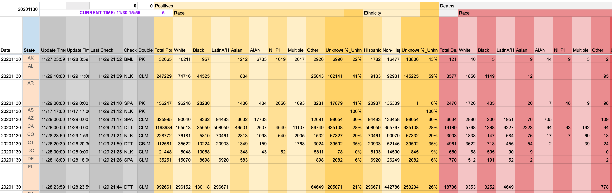

This is a continuation of the [third session](https://learn.r-journalism.com/en/wrangling/tidyr_joins/tidyr-joins/) of Center for Health Journalism's 2020 [R Introduction course](https://learn.r-journalism.com/).

```{r setup, include=FALSE, echo=FALSE}
library(tidyverse)
library(learnr)
library(lubridate)
library(gradethis)
library(DT)

race <- read_csv("https://docs.google.com/spreadsheets/d/e/2PACX-1vS8SzaERcKJOD_EzrtCDK1dX1zkoMochlA9iHoHg_RSw3V8bkpfk1mpw4pfL5RdtSOyx_oScsUtyXyk/pub?gid=43720681&single=true&output=csv")


race_long <- race %>% 
  pivot_longer(cols=3:54,
               names_to="type",
               values_to="total") %>% 
  group_by(State, type) %>% 
  slice(1)

race_longer <- race_long %>% 
  separate(type, c("count_type", "race_ethnicity"), 
                 sep="_",
                 extra="merge")

race_long_deaths <- race_longer %>% 
  filter(count_type=="Deaths") %>% 
  filter(race_ethnicity!="Total") %>% 
  filter(!str_detect(race_ethnicity, "Ethnicity_")) %>% 
  group_by(State) %>% 
  mutate(percent_deaths=round(total/sum(total, na.rm=T)*100,2))


race_wide_deaths_percent <- race_long_deaths %>% 
  select(State, race_ethnicity, percent_deaths) %>% 
  pivot_wider(names_from=race_ethnicity,
              values_from=percent_deaths) %>% 
  # and let's sort by state with the highest percent of Black deaths from covid-19
  arrange(desc(Black))

state_pop <- read_csv("https://docs.google.com/spreadsheets/d/e/2PACX-1vQkV8WSPqzlIvviX3OwZJ6eGsQZmcmsuoe4W_OKvWnmzYG0-4sX9XhVkLk25VeBafosYi3b4EVRHOZp/pub?output=csv")

state_pop_renamed <- state_pop %>% 
  rename(race_ethnicity=race, State=state_abb)

state_pop_deaths <- left_join(state_pop_renamed, race_long_deaths)
race_pop_deaths <- left_join(race_long_deaths, state_pop_renamed)

race_long_death_adjusted <- race_long_deaths %>% 
  # creating a new column based on what's in race_ethnicity
  # changing some categories and leaving others the same
  mutate(race_ethnicity=case_when(
    # note the "~" and where the "," are. Very important    
    race_ethnicity=="AIAN" ~ "American Indian",
    race_ethnicity=="Latinx" ~ "Hispanic",
    # IF race_ethnicity don't match any of these criteria than leave the original racet_ethnicity
    TRUE ~ race_ethnicity
  ))

joined_pop_deaths <- race_long_deaths %>% 
  # changing some categories and leaving others the same
  mutate(race_ethnicity=case_when(
    # note the "~" and where the "," are. Very important    
    race_ethnicity=="AIAN" ~ "American Indian",
    race_ethnicity=="Latinx" ~ "Hispanic",
    # IF race_ethnicity don't match any of these criteria than leave the original racet_ethnicity
    TRUE ~ race_ethnicity
  )) %>% 
  right_join(state_pop_renamed)

mandates <- read_csv("https://docs.google.com/spreadsheets/d/e/2PACX-1vRotMuDYwYiG7_HAY8ckW4DBNDRi35UTsaDhxeYeHAJu26XTCZNTTchtsIZ0HABbsnseoJNhO0kdENf/pub?output=csv")

total_state_deaths <- race_longer %>% 
     filter(count_type=="Deaths") %>% 
     filter(race_ethnicity=="Total")
```


## tidyr

Data journalism is a journey. You'll rarely get a data set that you can immediately turn around and come to conclusions with. 

But that presents itself an opportunity. 

The more difficult the process, the more likely you'll found something original that no one else has noticed before.

We're going to learn a couple new concepts from a few packages while digging through this **covid race** database: **tidyr, stringr, and lubridate**. 

Today's lesson will be based around cleaning up a couple of data sets so that we can analyze them effectively.

Let's import the latest raw data from the [Covid Tracking Project](https://covidtracking.com/race/dashboard):

```{r importing_data, eval=F}
library(readr)

race <- read_csv("https://docs.google.com/spreadsheets/d/e/2PACX-1vS8SzaERcKJOD_EzrtCDK1dX1zkoMochlA9iHoHg_RSw3V8bkpfk1mpw4pfL5RdtSOyx_oScsUtyXyk/pub?gid=43720681&single=true&output=csv")

```


Data can be messy but there's an ideal structure for how to stack your data.

And that's with 

1. Each **variable** is in its own **column**
2. Each **case** is in its own **row**
3. Each **value** is in its own **cell**

Here's a simple example of a tidy data set (I'm slicing out some specific columns from the imported race data):

```{r tidy1, warning=F, message=F}
library(dplyr)

race %>% 
  filter(State=="CA") %>% 
  select(Date, State, Deaths_Total, Deaths_Black)
```

This type of data structure is easy to mutate and manipulate (and also is how a lot of data viz tools prefer their data structured).

### Exercise 1

Add a line to the end of this code that will add a column to calculate the `percent_black_deaths` from the code above.

You'll have to think about the math formula to create a percent.


```{r tidy2, exercise=TRUE}
race %>% 
  filter(State=="CA") %>% 
  select(Date, State, Deaths_Total, Deaths_Black) %>% 

# add line above
```

```{r tidy2-solution}
race %>% 
  filter(State=="CA") %>% 
  select(Date, State, Deaths_Total, Deaths_Black) %>% 
  mutate(percent_black_deaths=Deaths_Black/Deaths_Total*100)
```

```{r tidy2-code-check}
grade_code()
```

<div id="tidy2-hint">
**Hint:** use the `mutate()` function.
</div>

### Not tidy

On the other hand, the example data below is **not** tidy.


Why is this dataframe untidy? It's because it is too wide.

Each day gets its own column. Which is usually easy to read from left to right to detect trends.

But this goes on way too wide.

You've probably seen data structured like this-- and it's fine for presentation in a spreadsheet. But for data analysis, it's simply not tidy.

For contrest, this is what a portion of the data looks like that we just imported from the [Covid Tracking Project](https://docs.google.com/spreadsheets/u/1/d/e/2PACX-1vR_xmYt4ACPDZCDJcY12kCiMiH0ODyx3E1ZvgOHB8ae1tRcjXbs_yWBOA4j4uoCEADVfC1PS2jYO68B/pubhtml#).


```{r img0, echo = F, out.width="100%"}
library(knitr)

``` 

I would call it semi-tidy.

Mostly not.

Take a look at all the columns in this data set using R in this browser.

### Exercise 2

Use the **dplyr** function to view a summary of the dataframe (without using the base `summary()` function) so you can get a clean view of the columns.

```{r tidy3, exercise=TRUE, exercise.blanks = "_______+"}
_______(race)
```

```{r tidy3-solution}
glimpse(race)
```


```{r tidy3-code-check}
grade_code()
```


<div id="tidy3-hint">
**Hint:** The function starts with a "g".
</div>

### Wide groups

Wow, there are *54 columns* in this dataframe.

You can see how it's meant to be interpreted as parts of different groups. How do we turn this data long?

There are too many differing types-- *Cases_*, *Deaths_*, and *Hosp_* should not be on the same column.

But sometimes you'll get data from sources this way or your analysis will generate data like that. How's the phrase go? *85 percent of data analysis is cleaning up data*?

Let's take a look at the **race** dataframe again.

First, let's figure out what question we want to answer using this data?

*Goal: Analyze percents of deaths by race in a state*

We're going to use the **DT** package to help work through this data. It brings in the [DataTables](https://www.google.com/search?q=datatables+plugin&rlz=1C5CHFA_enUS749US749&oq=datatables+plug&aqs=chrome.0.69i59j69i57j0l4.3719j0j1&sourceid=chrome&ie=UTF-8) jquery plug-in that makes it easier to interact with tables in R. 


Let's start to wrangle the data from wide to long.

### pivot_longer()

```{r img1, echo = F, out.width="100%"}
library(knitr)
include_graphics("images/pivot_longer_chart.png")
```

The `pivot_longer()` function in the **tidyr** package moves values into column names. We can finally load that package.


```{r img2, echo = F, out.width="100%"}
include_graphics("images/pivot_longer_diagram.png")
```

Four reasons why you should attempt to structure your data in long (tall) form:

* If you have many columns, it’s difficult to summarize it at a glance and see if there are any mistakes in the data.
* Key-value pairs facilitates conceptual clarity
* Easier to do math on groups of numbers in columns than in rows
* Long-form datasets are required for graphing and advanced statistical analysis

```{r investigate0, warning=F, message=F}
# If you don't have DT installed yet, uncomment the line below and run it

#install.packages("DT")

library(DT)

library(tidyr)

race_long <- race %>% 
  # WE ARE KEEPING THE DATE AND STATE COLUMNS
  # THAT IS WHY WE ARE STARTING ON ROW 3 AND ENDING ON
  # THE TOTAL NUMBER OF COLUMNS IN THE DATA FRAME
  pivot_longer(cols=3:54,
               names_to="type",
               values_to="total") %>% 
  # we need to limit it to only the most recent day of data
  # or it could get very long
  group_by(State, type) %>% 
  slice(1)

datatable(race_long)
```

Scroll through the results. 

We went from *54* columns to *4*.

Let's clean it up some more. We can't mix up cases with deaths and hospitalizations.

There is a pattern we can break up type into:

For all the different types, aside from race, they're preceded by the Cases_/Deaths/Hosp_ prefix.

Let's create a new column that will split up the race with the count type.

We'll use the `separate()` function.

This will create two new columns: count_type and race_ethnicity based on the `_` separator. Any following `_` will be combined into the race_ethnicity column.

### Exercise 3

Try to figure it out. Use the hint.

```{r investigate3, exercise=TRUE}
race_longer <- race_long %>% 
  ________(____, c("count_type", "race_ethnicity"), 
                 sep=___,
                 extra="merge")

race_longer
```

```{r investigate3-solution}
race_longer <- race_long %>% 
  separate(type, c("count_type", "race_ethnicity"), 
                 sep="_",
                 extra="merge")
race_longer
```


```{r investigate3-code-check}
grade_code()
```


<div id="investigate3-hint">
**Hint:** Use the function I mentioned above on the `type` column. Also, strings are in quotations, remember?
</div>


### Tidy data now

Congrats!

To make it workable, we can just filter and focus on the count_type we want.

Next, we need to filter the data frame (make sure you hit the "Run Code" in the section above so you're looking at the dataframe):

 * **Deaths** only
 
 * We can **exclude** Totals
 
 * We'll exclude Ethnicity counts because that's a separate group and could throw things off if we include them when calculating percents
 
There are three different Ethnicity types in the race_ethnicity column. To catch all the ones that start with "Ethnicity_", we'll use the `str_detect()` function from **stringr**.

Let's load that package first.

```{r install_stringr0, warning=F, message=F}
library(stringr)
```

### Exercise 4

Fix lines 4 and 5.

```{r investigate2, exercise=TRUE}
race_long_deaths <- race_longer %>% 
  # can you find the right column to filter to deaths?
  filter(__________==________) %>% 
  filter(race_ethnicity__"Total") %>% 
  filter(!str_detect(race_ethnicity, "Ethnicity_"))

race_long_deaths  
```


```{r investigate2-solution}
race_long_deaths <- race_longer %>% 
  filter(count_type=="Deaths") %>% 
  filter(race_ethnicity!="Total") %>% 
  filter(!str_detect(race_ethnicity, "Ethnicity_"))

race_long_deaths
```

```{r investigate2-code-check}
grade_code()
```

<div id="investigate2-hint">
**Hint:** != means doesn't equal
</div>


### Calculate percents by state

Alright, now we can go about calculating the percent of deaths by race in each state.

```{r investigate4}
race_long_deaths <- race_long_deaths %>% 
  group_by(State) %>% 
  mutate(percent_deaths=round(total/sum(total, na.rm=T)*100,2))

datatable(race_long_deaths)
```

Okay, this is looking good.

This data structure is perfect for making visualizations with.

But before we move on to that, let's reformat the dataframe for table display.

At the moment, we have six columns and 504 rows-- that's a lot to scroll through.

Let's create a percent-only table for each state and have the race be the columns.

For that, well need to use:

### pivot_wider()


```{r img3, echo = F, out.width="100%"}
#library(knitr)
include_graphics("images/pivot_wider_chart.png")
```

The `spread()` function in the **tidyr** package moves values into column names.


```{r img4, echo = F, out.width="100%"}
include_graphics("images/pivot_wider_diagram.png")
```

We need to be choosy with the columns we use and display. Because space is limited.

Also, we don't need count_type because they're all Deaths.

### Exercise 5

Fill in the columns to pull names_from and values_from.

```{r investigate5, exercise=TRUE}
race_wide_deaths_percent <- race_long_deaths %>% 
  select(State, race_ethnicity, percent_deaths) %>% 
  pivot_wider(names_from=______________,
              values_from=______________) %>% 
  # and let's sort by state with the highest percent of Black deaths from covid-19
  arrange(desc(Black))
  
  
race_wide_deaths_percent
```


```{r investigate5-solution}
race_wide_deaths_percent <- race_long_deaths %>% 
  select(State, race_ethnicity, percent_deaths) %>% 
  pivot_wider(names_from=race_ethnicity,
              values_from=percent_deaths) %>% 
  # and let's sort by state with the highest percent of Black deaths from covid-19
  arrange(desc(Black))
  
race_wide_deaths_percent
```

```{r investigate5-code-check}
grade_code()
```


Alright, there we go. 


Before we move on, I want to point out that `pivot_wider()` and `pivot_longer()` are way more powerful in reshaping data than what I've shown you. Look them up [the documentation](https://tidyr.tidyverse.org/reference/pivot_wider.html) when you have time.

Here's one more example that allows you to create column names from multiple variables and fills in the blank values (NA) that show up as a result of a pivot with zeroes using the values_fill argument in the function:


```{r investigate6}
race_wide_deaths_total_percent <- race_long_deaths %>% 
  select(State, race_ethnicity, percent_deaths, total) %>% 
  filter(!is.na(total)) %>% 
  filter(!is.na(percent_deaths)) %>% 
  pivot_wider(names_from=race_ethnicity,
              values_from=c(total,percent_deaths),
              values_fill = 0)
  
datatable(race_wide_deaths_total_percent)
```


It looks like DC and Mississippi have the largest share of population with Covid.

Okay, but...

The basic tenet of data journalism is to not use a number by itself, but to compare it with something else. To prove the "So What?"

How about we join it with state population breakdowns to see which states have the biggest disparity among races?


```{r importing_census, eval=F}

state_pop <- read_csv("https://docs.google.com/spreadsheets/d/e/2PACX-1vQkV8WSPqzlIvviX3OwZJ6eGsQZmcmsuoe4W_OKvWnmzYG0-4sX9XhVkLk25VeBafosYi3b4EVRHOZp/pub?output=csv")

```

Let's take a peek inside the data:

```{r glimpse_census}
state_pop
```

## joins

A join combines two data sets by adding the columns of one data set alongside the columns of the other, usually some of the rows of the second data set along with some rows of the first data set.

A successful join requires something consistent between two data sets to match on: keys.

What are the keys that the the covid data and the census data can join on? Take a look again.


```{r glimpse_census_race}

glimpse(state_pop)
glimpse(race_long_deaths)
```

OK, **state_pop** has 260 rows (and 9 columns) and **race_long_deaths** has 504 rows (and 6 columns).

There are more race categories in **race_long_deaths** than in **state_pop**. Will that be an issue? Maybe. We'll revisit that soon.

What's consistent about each of them? Column names, sure. What else specifically?

### What are they keys to join on?

States and race!

The **dplyr** package has quite a few functions we can use.

Let's start:

### left_join()


Look how `left_join()` affects the first and second illustrated data frames. What gets left off?

```{r img4j, echo = F, out.width="100%"}
include_graphics("images/leftjoin.png")
```

When you use `left_join()` any rows from the second data frame that doesn't match the target data frame are dropped, as illustrated above.

Before we do, we must prepare the dataframes so the columns we want to join on are matching.

* What is the column name in `state_pop` with race? *race*

* What is the column name in `state_pop` with state abbreviations? *state_abb*

* What is the column name in `race_long_deaths` with race? *race_ethnicity*

* What is the column name in `race_long_deaths` with state abbreviations? *State*

Let's create a new dataframe called **state_pop_renamed** use the `rename()` function to rename the columns in **state_pop** to match the columns in **race_long_deaths**.

### Exercise 6

```{r rename, exercise=TRUE}
state_pop_renamed <- state_pop %>% 
  ______(race_ethnicity=race, State=state_abb)

# put in the function name above

glimpse(state_pop_renamed)
```

```{r rename-solution}
state_pop_renamed <- state_pop %>% 
  rename(race_ethnicity=race, State=state_abb)

glimpse(state_pop_renamed)
```

```{r rename-code-check}
grade_code()
```

Now that the data is prepped, let's join **state_pop_renamed** to **race_long_deaths**.

```{r join1}

race_pop_deaths <- left_join(race_long_deaths, state_pop_renamed)

glimpse(race_pop_deaths)
```

We got the message `## Joining, by = c("race_ethnicity", "State")` -- that means we were successful in renaming the columns to join correctly!

Alright, so, the columns grew from 9 columns to 13 after this join. 

But the row count for **state_pop_renamed** stayed at 260.

What if we reversed the order by joining **race_long_deaths** to **state_pop_renamed**?

### Exercise 7

```{r rename_reverse, exercise=TRUE}
# reverse the arguments based on the code above
state_pop_deaths  <- left_join(______, ______)

glimpse(state_pop_deaths )
```


```{r rename_reverse-solution}
# reverse the arguments based on the code above
state_pop_deaths <- left_join(state_pop_renamed, race_long_deaths)

glimpse(state_pop_deaths)
```

```{r rename_reverse-code-check}
grade_code()
```

Okay, this time the columns grew to 13 like before but the number of rows was consistent with the left-most argument, **state_pop_renamed** at 260 rows.

This second join dropped 244 rows, which in this case is fine! You just need to be aware of it.

In all joins, you pass two variables: the first one is the target data frame and the second one is the data frame you're bringing over. By default the function will look to join on column names that are the same (You can join by more than one column name, by the way). You can also specify which column the columns should join by.

Which one you use as your first argument depends on what you want to do!

There are several other types of joins:

* `right_join()` - does the opposite of `left_join()`

* `full_join()` - doesn't drop anything. It keeps all the failed joins.

* `inner_join()` - drops the non-matches in dataframe 1 and datframe 2 so it's just a clean join

Let's take a closer look at **state_pop_deaths**

```{r state_pop_renamed}
state_pop_deaths %>% 
  select(NAME, population, pct_pop, race_ethnicity, count_type, total, percent_deaths) %>% 
  datatable()
```

Do you notice the lack of data under *count_type*, *total*, etc for the American Indian and Hispanic rows?

Why do you think that is?

That's because "American Indian" is "AIAN" in the **race_pop_deaths** dataframe/*race_ethnicity* column and "Hispanic" is "Latinx".

To fix it, let's use the `case_when()` function within the `mutate()` verb in dplyr.

## case_when()

`case_when()` is a very powerful tool in a data journalist's arsenal.

It's like a readable **if-else** command.

Okay, this is what we're starting out with:

```{r race_long_deaths_count}
race_long_deaths %>%
  # ungroup() is used here because this dataframe still had its prior grouping
  ungroup() %>% 
  count(race_ethnicity)
```

```{r case_when}
race_long_death_adjusted <- race_long_deaths %>% 
  # changing some categories and leaving others the same
  mutate(race_ethnicity=case_when(
    # note the "~" and where the "," are. Very important    
    race_ethnicity=="AIAN" ~ "American Indian",
    race_ethnicity=="Latinx" ~ "Hispanic",
    # IF race_ethnicity don't match any of these criteria than leave the original racet_ethnicity
    TRUE ~ race_ethnicity
  )) 

race_long_death_adjusted %>% 
  ungroup() %>% 
  count(race_ethnicity)
```

Okay, that's slightly better. There are no NHPI or Multiracial or Other or Unknowns in the census data set so we'll just leave those behind.

Let's rejoin the data now but starting from scratch so you can try `case_when()` on your own.

### Exercise 8

```{r case_when_join, exercise=TRUE}
joined_pop_deaths <- race_long_deaths %>% 
  # changing some categories and leaving others the same
  mutate(race_ethnicity=case_when(
    # note the "~" and where the "," are. Very important    
    race_ethnicity==______ ~ "American Indian",
    race_ethnicity=="Latinx" ~ ____________,
    # IF race_ethnicity don't match any of these criteria than leave the original racet_ethnicity
    TRUE ~ race_ethnicity
  )) %>% 
  right_join(___________)

joined_pop_deaths %>% 
  select(NAME, population, pct_pop, race_ethnicity, count_type, total, percent_deaths) %>% 
  datatable()
```

```{r case_when_join-solution}
joined_pop_deaths <- race_long_deaths %>% 
  # changing some categories and leaving others the same
  mutate(race_ethnicity=case_when(
    # note the "~" and where the "," are. Very important    
    race_ethnicity=="AIAN" ~ "American Indian",
    race_ethnicity=="Latinx" ~ "Hispanic",
    # IF race_ethnicity don't match any of these criteria than leave the original racet_ethnicity
    TRUE ~ race_ethnicity
  )) %>% 
  right_join(state_pop_renamed)

joined_pop_deaths %>% 
  select(NAME, population, pct_pop, race_ethnicity, count_type, total, percent_deaths) %>% 
  datatable()
```

```{r case_when_join-code-check}
grade_code()
```

**Caveat about ranking states:** We've conveniently ignored the *Ethnicity_* columns for this exercise, but they are important to include. Some states do not differentiate between LatinX and White deaths. That's what the Hispanic designation in Ethnicity is used for in those states. It's too difficult to break that out in the aggregate form we've received the data. So my advice is don't compare states to each other. But compare individual state stats to their population percents.

So, for apples to apples, let's not compare the disparity between Hispanic population and share of Covid-19 deaths.

But let's do that for Black residents.

**Which five states ave the largest Black disparity between population and Covid-19 deaths?**

We'll need to do some math and `mutate()`

### Exercise 9

```{r black_gap, exercise=TRUE}
joined_pop_deaths %>% 
  filter(race_ethnicity==_______) %>% 
  mutate(point_diff=percent_deaths-_______) %>% 
  ______(desc(point_diff)) %>% 
  ungroup() %>% 
  head(5) %>% 
  select(State, race_ethnicity, percent_deaths, pct_pop, point_diff)
```

```{r black_gap-solution}
joined_pop_deaths %>% 
  filter(race_ethnicity=="Black") %>% 
  mutate(point_diff=percent_deaths-pct_pop) %>% 
  arrange(desc(point_diff)) %>% 
  ungroup() %>% 
  head(5) %>% 
  select(State, race_ethnicity, percent_deaths, pct_pop, point_diff)
```

```{r black_gap-code-check}
grade_code()
```

Okay, that's one possible story on our hands.

Let's do a little more using joins but this time some summarizing.

**Do state mandates have an effect on death rates?**

Let's bring in the two data sets to work with. 


```{r total_deaths}
total_state_deaths <- race_longer %>% 
     filter(count_type=="Deaths") %>% 
     filter(race_ethnicity=="Total")

glimpse(total_state_deaths)
```

```{r masks_import, warning=F, message=F}
mandates <- read_csv("https://docs.google.com/spreadsheets/d/e/2PACX-1vRotMuDYwYiG7_HAY8ckW4DBNDRi35UTsaDhxeYeHAJu26XTCZNTTchtsIZ0HABbsnseoJNhO0kdENf/pub?output=csv")

glimpse(mandates)
```

Your turn. 

Join **mandates** to **total_state_deaths** and then group by and calculate rates of deaths per capita.

### Exercise 10

```{r masks_analysis, exercise=TRUE}
total_state_deaths %>% 
  left_join(__________) %>% 
  filter(!is.na(Population)) %>% 
  group_by(_________) %>% 
  _________(population=sum(Population, na.rm=T),
            deaths=sum(total, na.rm=T)) %>% 
  ______(per_capita=deaths/population*10000)
```

```{r masks_analysis-solution}
total_state_deaths %>% 
  left_join(mandates) %>% 
  filter(!is.na(Population)) %>% 
  group_by(Mandate) %>% 
  summarize(population=sum(Population),
            deaths=sum(total)) %>% 
  mutate(per_capita=deaths/population*10000)
```

```{r masks_analysis-code-check}
grade_code()
```

Congrats! What'd you figure out?
