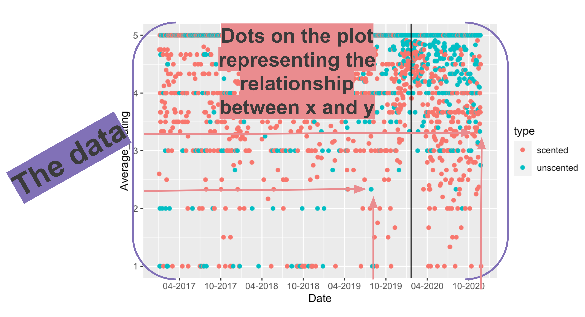

<style>
.cell-left {
  text-align: left;
}

.cell-right {
  text-align: right;
}

.cell-center {
  text-align: center;
}

table {
    margin: auto;
    border-top: 1px solid rgb(102, 102, 102);
    border-bottom: 1px solid rgb(102, 102, 102);
    display: table;
    border-collapse: separate;
    box-sizing: border-box;
    border-spacing: 2px;
    border-color: grey;
}

</style>

```{r importing_data_real, include=FALSE, echo=FALSE}
library(tidyverse)
library(learnr)
library(lubridate)
library(readxl)
library(DT)
library(flair)
library(janitor)

sd <- read_csv("san_diego.csv")

sd <- clean_names(sd)


sd_adjusted <- sd %>% 
  mutate(death_date=mdy(death_date)) %>% 
  mutate(month=month(death_date, label=TRUE, abbr=TRUE)) 

sd_month <- sd_adjusted %>% 
  count(year, month, manner_of_death, name="deaths") %>% 
  mutate(date=mdy(paste0(month, " 1, ", year)))

scented <- read_excel("Scented_all.xlsx", sheet=1)
unscented <- read_excel("Unscented_all.xlsx", sheet=1)

scented <- scented %>% 
  mutate(type="scented")
  
unscented <- unscented %>% 
  mutate(type="unscented")

scented <- bind_rows(scented, unscented)

scented_summary <- scented %>%
  arrange(Date) %>%
  filter(Date >= "2017-01-01") %>%
  mutate(Date=ymd(Date)) %>% 
  filter(CandleID <= 3) %>%
  group_by(Date, type) %>%
  summarise(Average_Rating=mean(Rating),
            Reviews=n())
  

nospace <- function(a) {
  b <- gsub(" ","",a) 
  gsub("\\n", "", b)
}


is_bad_code <- function(user_code, check_code, envir_result) {

  is_null <- is.null(eval(parse(text = user_code)))
  e_rows <- nrow(eval(parse(text = user_code)))
  r_rows <- nrow(eval(parse(text = check_code), envir = envir_result))
  e_cols <- ncol(eval(parse(text = user_code)))
  r_cols <- ncol(eval(parse(text = check_code), envir = envir_result))
  e_type <- typeof(eval(parse(text = user_code)))
  r_type <- typeof(eval(parse(text = check_code), envir=envir_result))
  e_len <- length(eval(parse(text = user_code)))
  r_len <- length(eval(parse(text = check_code)))
  if (is_null!=T){
    if (e_len!=0 & r_len!=0) {
      if (e_type==r_type) {
        if (e_type!="character" & e_type!="double" & e_type!="integer" & e_type!="logical") {
          if (e_rows==r_rows && e_cols==r_cols) {
            eval(parse(text = user_code)) != eval(parse(text = check_code), envir = envir_result)
          } else {
            TRUE
          }
        } else { eval(parse(text = user_code)) != eval(parse(text = check_code), envir = envir_result) }
      } else {
        TRUE
      }
    } else { TRUE }
  } else { nospace(user_code) != nospace(check_code)}
}

checker <- function(label, user_code, check_code, envir_result, evaluate_result, ...) {
  if (is_bad_code(user_code, check_code, envir_result)) {
    return(list(message = "Code wasn't right!", correct = FALSE, location = "append"))
  } else {
    return(list(message = "Great Job!", correct = TRUE, location = "append"))
  }
}  

tutorial_options(exercise.timelimit = 30, exercise.checker = checker)

```

Note: All answers to exercises can be found [here](https://github.com/utdata/chj-r-introduction/blob/main/chj-day4/chj-day4-answers.Rmd).

## Data introduction

Before we begin, let's bring in some data. 

Download these files to your project folder.

```{r download}
# https://github.com/kateptrv/Candles/raw/main/Scented_all.xlsx
# https://github.com/kateptrv/Candles/raw/main/Unscented_all.xlsx
```

These are Excel files and not CSVs, so we need a special package to import those tricky files in. We'll use one called **readxl**.

```{r import_fake, eval=F}
library(readxl)

scented <- read_excel("Scented_all.xlsx", sheet=1)
unscented <- read_excel("Unscented_all.xlsx", sheet=1)
```

Let's take a look at what were working with:

```{r view_unscented}
library(DT)
library(dplyr)

scented <- read_excel("Scented_all.xlsx", sheet=1)
unscented <- read_excel("Unscented_all.xlsx", sheet=1)

scented <- scented %>% 
  mutate(type="scented")
  
unscented <- unscented %>% 
  mutate(type="unscented")

scented <- bind_rows(scented, unscented)

scented %>% 
  head(4) %>% 
  datatable()
```

These are more than 21,000 reviews for the top 5 rated scented and unscented candles on Amazon. It goes back years.

Let's quickly filter this data to the top 3 candles only and figure out the `Average_Rating` for each day. And also count the total `Reviews` for each day. And we should convert the dates in the `Date` column with a **lubridate** function.

```{r lub, echo=F}
library(lubridate)
```

### Exercise 1

Fill in the blanks with the right code.

```{r scented, exercise=TRUE, warning=F, message=F}
scented_summary <- scented %>%
  arrange(Date) %>%
  filter(Date >= "2017-01-01") %>%
  # convert the String Date into a date format using lubridate function
  mutate(Date=___(Date)) %>% 
  filter(CandleID <= 3) %>%
  group_by(Date, type) %>% 
  # Now how do we aggregate average and count?
  _________(Average_Rating=____(Rating),
            Reviews=___)
  
scented_summary
```


```{r scented-check, warning=F, message=F}
scented_summary <- scented %>%
  arrange(Date) %>%
  filter(Date >= "2017-01-01") %>%
  # convert the String Date into a date format using lubridate function
  mutate(Date=ymd(Date)) %>% 
  filter(CandleID <= 3) %>%
  group_by(Date, type) %>%
  # Now how do we aggregate average and count?
  summarise(Average_Rating=mean(Rating),
            Reviews=n())

scented_summary
```


<div id="scented-hint">
**Hint:** ymd(), group_by(), summarize(), mean(), n()
</div>

We've narrowed down 21,000 rows of data to a more workable 2,471.

This summarized data set will be our entry to the:

## Grammar of Graphics

Here's a quick chart. You may not understand the code yet, but I'll break it down for you after we talk about some concepts.

```{r first_chart}
ggplot(data= scented_summary) +
  geom_point(mapping=aes(x= Date, y= Average_Rating, colour=type)) +
  geom_vline(xintercept= ymd("2020-01-20")) +
  scale_x_date(date_labels = "%m-%Y", date_breaks = "6 month")
```

### Mapping data to aesthetics

**Aesthetic**

* Visual property of a graph

* Position, shape, color, etc.

**Data**

* A column in a dataset

Here's are the core components of this chart:

<table>
  <tr>
    <th class="cell-left">Data</th>
    <th class="cell-left">Aesthetic</th>
    <th class="cell-left">Graphic/Geometry</th>
  </tr>
  <tr>
    <td class="cell-left">Dates</td>
    <td class="cell-left">Position (x-axis)&emsp;</td>
    <td class="cell-left">Point</td>
  </tr>
  <tr>
    <td class="cell-left">Rating</td>
    <td class="cell-left">Position (y-axis)</td>
    <td class="cell-left">Point</td>
  </tr>
    <tr>
    <td class="cell-left">Candle type</td>
    <td class="cell-left">Color</td>
    <td class="cell-left">Point</td>
  </tr>
  <tr>
    <td class="cell-left">Single date</td>
    <td class="cell-left">Position (x-intercept)</td>
    <td class="cell-left">Line</td>
  </tr>
</table>

Here's how it's interpreted in ggplot2 code

<table>
  <tr>
    <th class="cell-left">Data</th>
    <th class="cell-left">aes()</th>
    <th class="cell-left">geom</th>
  </tr>
  <tr>
    <td class="cell-left">Dates</td>
    <td class="cell-left">x</td>
    <td class="cell-left">geom_point()</td>
  </tr>
  <tr>
    <td class="cell-left">Average_Rating</td>
    <td class="cell-left">y</td>
    <td class="cell-left">geom_point()</td>
  </tr>
  <tr>
    <td class="cell-left">type</td>
    <td class="cell-left">color</td>
    <td class="cell-left">geom_point()</td>
  </tr>
  <tr>
    <td class="cell-left">1/20/2020</td>
    <td class="cell-left">xintercept</td>
    <td class="cell-left">geom_vline()</td>
  </tr>
</table>


### ggplot() template

Here's the dataframe called `scented_summary` as a reminder:

```{r preview}
scented_summary %>% head(5)
```


```{r show-ggplot-template, echo=FALSE, tidy=FALSE}
decorate('
ggplot(data = DATA) +
  GEOM_FUNCTION(mapping = aes(AESTHETIC MAPPINGS))
', eval = FALSE) %>% 
  flair("DATA", background = "#CBB5FF", before = "<b>", after = "</b>") %>% 
  flair("GEOM_FUNCTION", background = "#FFDFD1", before = "<b>", after = "</b>") %>% 
  flair("AESTHETIC MAPPINGS", background = "#FFD0CF", before = "<b>", after = "</b>") %>% 
  knit_print.with_flair()
```

--

```{r ggplot-template-example, echo=FALSE}
decorate('
ggplot(data = scented_summary) +
  geom_point(mapping = aes(x = Date, y = Average_Rating, color = type)) +
  geom_vline(xintercept=ymd("2020-01-20")) 
', eval = FALSE) %>%
  flair("scented_summary", background = "#CBB5FF", before = "<b>", after = "</b>") %>% 
  flair("geom_point", background = "#FFDFD1", before = "<b>", after = "</b>") %>% 
  flair("geom_vline", background = "#FFDFD1", before = "<b>", after = "</b>") %>% 
  flair_rx('x = Date|y = Average_Rating|color = type|xintercept= ymd("2020-01-20")', 
           background = "#FFD0CF", before = "<b>", after = "</b>") %>% 
  knit_print.with_flair()
```

---

```{r img0, echo = F, out.width="100%"}
library(knitr)

``` 

### Grammatical layers

So far we know about data, aesthetics, and geometries.

Think of these components as **layers**.


```{r img1a, echo = F, out.width="50%"}
include_graphics("images/ggplot1a.png")
``` 

Add them to foundational `ggplot()` with +

**Possible aesthetics**

```{r img2a, echo = F, out.width="100%"}
include_graphics("images/ggplot2a.png")
``` 


**Possible geoms**

```{r img3a, echo = F, out.width="60%"}
include_graphics("images/ggplot3a.png")
``` 

THERE ARE [SO MANY GEOMS](https://twitter.com/search?q=geom_%20%23rstats&src=typed_query&f=image) for different visualizations. Here are the [official ones](https://ggplot2.tidyverse.org/reference/index.html#section-layer-geoms).

### Additional layers

There are many of other grammatical layers we can use to describe graphs.

We sequentially add layers onto the foundational `ggplot()` plot to create complex figures.


```{r img4a, echo = F, out.width="50%"}
include_graphics("images/ggplot4a.png")
``` 

Scales change the properties of the variable mapping.

<table>
  <tr>
    <th class="cell-left">Example layer</th>
    <th class="cell-left">What it does</th>
  </tr>
  <tr>
    <td class="cell-left"><code class="remark-inline-code">scale_x_continuous()</code></td>
    <td class="cell-left">Make the x-axis continuous</td>
  </tr>
  <tr>
    <td class="cell-left"><code class="remark-inline-code">scale_x_continuous(breaks = 1:5)&ensp;</code></td>
    <td class="cell-left">Manually specify axis ticks</td>
  </tr>
  <tr>
    <td class="cell-left"><code class="remark-inline-code">scale_x_date()</code></td>
    <td class="cell-left">Considers x-axis dates</td>
  </tr>
  <tr>
    <td class="cell-left"><code class="remark-inline-code">scale_color_gradient()</code></td>
    <td class="cell-left">Use a gradient</td>
  </tr>
  <tr>
    <td class="cell-left"><code class="remark-inline-code">scale_fill_viridis_d()</code></td>
    <td class="cell-left">Fill with discrete viridis colors</td>
  </tr>
</table>

----

Look at the difference between these two charts without and with a scales function. 

```{r second_chart}
ggplot(data= scented_summary) +
  geom_point(mapping=aes(x= Date, y= Average_Rating, color=type)) +
  geom_vline(xintercept= ymd("2020-01-20"))
```

Check out the x-axis.

### Exercise 2

Now add `scale_x_date(date_labels = "%m-%Y", date_breaks = "6 month")` to the bottom of the code


```{r scented2, exercise=TRUE, warning=F, message=F}
ggplot(data= scented_summary) +
  geom_point(mapping=aes(x= Date, y= Average_Rating, color=type)) +
  geom_vline(xintercept= ymd("2020-01-20")) +

```


### Facets

Facets show subplots for different subsets of data.

<table>
  <tr>
    <th class="cell-left">Example layer</th>
    <th class="cell-left">What it does</th>
  </tr>
  <tr>
    <td class="cell-left"><code class="remark-inline-code">facet_wrap(vars(type))</code></td>
    <td class="cell-left">Plot for each candle type</td>
  </tr>
  <tr>
    <td class="cell-left"><code class="remark-inline-code">facet_wrap(vars(type, year))</code>&emsp;</td>
    <td class="cell-left">Plot for each candle type/year</td>
  </tr>
  <tr>
    <td class="cell-left"><code class="remark-inline-code">facet_wrap(..., ncol = 1)</code></td>
    <td class="cell-left">Put all facets in one column</td>
  </tr>
  <tr>
    <td class="cell-left"><code class="remark-inline-code">facet_wrap(..., nrow = 1)</code></td>
    <td class="cell-left">Put all facets in one row</td>
  </tr>
</table>


```{r facet_example1, warning=F, message=F}
ggplot(data= scented_summary) +
  geom_point(mapping=aes(x= Date, y= Average_Rating, color=type)) +
  geom_vline(xintercept= ymd("2020-01-20")) +
  scale_x_date(date_labels = "%m-%Y", date_breaks = "6 month") +
  facet_wrap(vars(type))
```

### Exercise 3

Now, try it with nrow=1 or ncol=1

```{r facet_example2, exercise=T, warning=F, message=F}
ggplot(data= scented_summary) +
  geom_point(mapping=aes(x= Date, y= Average_Rating, color=type)) +
  geom_vline(xintercept= ymd("2020-01-20")) +
  scale_x_date(date_labels = "%m-%Y", date_breaks = "6 month") +
  facet_wrap(vars(type), ___ = 1)
```


### Labels


<table>
  <tr>
    <th class="cell-left">Example layer</th>
    <th class="cell-left">What it does</th>
  </tr>
  <tr>
    <td class="cell-left"><code class="remark-inline-code">labs(title = "Neat title")</code></td>
    <td class="cell-left">Title</td>
  </tr>
  <tr>
    <td class="cell-left"><code class="remark-inline-code">labs(caption = "Something")</td>
    <td class="cell-left">Caption</td>
  </tr>
  <tr>
    <td class="cell-left"><code class="remark-inline-code">labs(y = "Something")</td>
    <td class="cell-left">y-axis</td>
  </tr>
  <tr>
    <td class="cell-left"><code class="remark-inline-code">labs(color = "Type")</code></td>
    <td class="cell-left">Title of size legend</td>
  </tr>
</table>

```{r labels-example, tidy=FALSE, message=FALSE}
ggplot(data= scented_summary) +
  geom_point(mapping=aes(x= Date, y= Average_Rating, color=type)) +
  geom_vline(xintercept= ymd("2020-01-20")) +
  scale_x_date(date_labels = "%m-%Y", date_breaks = "6 month") +
  labs(title = "Candle reviews on Amazon.com",
       subtitle = "Top 3 most popular candles 2017-2020",
       x = "Date",
       y = "Average daily rating (1-5)",
       color = "Type",
       caption = "Source: Kate Petrova")
```

### Theme

Change the appearance of anything in the plot.

There are many built-in themes.


<table>
  <tr>
    <th class="cell-left">Example layer</th>
    <th class="cell-left">What it does</th>
  </tr>
  <tr>
    <td class="cell-left"><code class="remark-inline-code">theme_grey()</code></td>
    <td class="cell-left">Default grey background</td>
  </tr>
  <tr>
    <td class="cell-left"><code class="remark-inline-code">theme_bw()</td>
    <td class="cell-left">Black and white</td>
  </tr>
  <tr>
    <td class="cell-left"><code class="remark-inline-code">theme_dark()</td>
    <td class="cell-left">Dark</td>
  </tr>
  <tr>
    <td class="cell-left"><code class="remark-inline-code">theme_minimal()</code></td>
    <td class="cell-left">Minimal</td>
  </tr>
</table>

### Exercise 4

Try out the different themes listed above in the code below.

```{r themes-example, exercise=TRUE, tidy=FALSE, message=FALSE}
ggplot(data= scented_summary) +
  geom_point(mapping=aes(x= Date, y= Average_Rating, color=type)) +
  geom_vline(xintercept= ymd("2020-01-20")) +
  scale_x_date(date_labels = "%m-%Y", date_breaks = "6 month") +
  labs(title = "Candle reviews on Amazon.com",
       subtitle = "Top 3 most popular candles",
       x = "Date",
       y = "Average rating",
       color = "Type",
       caption = "Source: Kate Petrova") +
  theme______
```

### More themes

There are a collections of pre-built themes online, like the [ggthemes package](https://jrnold.github.io/ggthemes/).

Organizations often make their own custom themes, like [the BBC](https://bbc.github.io/rcookbook/).


```{r img10, echo = F, out.width="100%"}
include_graphics("images/bbc-cookbook.png")
``` 

### Theme adjustments

Make theme adjustments with `theme()`

There are a billion options here!

Add this chunk of code in the exercise below it:

```{r eval=F}
theme_bw() + 
theme(legend.position = "bottom",
      plot.title = element_text(face = "bold"),
      panel.grid = element_blank(),
      axis.title.y = element_text(face = "italic"))
```

### Exercise 5

```{r themes-example2, exercise=TRUE, tidy=FALSE, message=FALSE}
ggplot(data= scented_summary) +
  geom_point(mapping=aes(x= Date, y= Average_Rating, color=type)) +
  geom_vline(xintercept= ymd("2020-01-20")) +
  scale_x_date(date_labels = "%m-%Y", date_breaks = "6 month") +
  labs(title = "Candle reviews on Amazon.com",
       subtitle = "Top 3 most popular candles",
       x = "Date",
       y = "Average rating",
       color = "Type",
       caption = "Source: Kate Petrova") +
  theme______
```

These were just a few examples of layers.

```{r img11, echo = F, out.width="50%"}
include_graphics("images/ggplot5.png")
``` 

See the [ggplot2 documentation](https://ggplot2.tidyverse.org/reference/index.html) for complete examples of everything you can do

One last thing: I want to add one more geom_ so that it's more obvious what the pattern is.

`geom_smooth()`

I'm also going to move the mapping to the first line so it will be consistent for all `geoms_` after.

```{r themes-example-last, tidy=FALSE, message=FALSE, fig.width=8}
ggplot(data= scented_summary, 
       mapping=aes(x= Date, y= Average_Rating)) +
  geom_point(alpha = 0.2, colour = "goldenrod3") +
geom_smooth(method = "loess", size = 1.5, colour = "goldenrod3", fill = "goldenrod3") +
  geom_vline(xintercept= ymd("2020-01-20")) +
  facet_wrap(vars(type), ncol=2) +
  scale_x_date(date_labels = "%m-%Y", date_breaks = "12 month") +
  labs(title = "Candle reviews on Amazon.com",
       subtitle = "Top 3 most popular candles",
       x = "Date",
       y = "Average rating",
       color = "Type",
       caption = "Source: Kate Petrova") +
  theme_minimal()
```

 It seems obvious that there's a trend here, right?
 
 Why do you think that is?
 
 ### Let's find out
 
 Let's add a column flagging whether any variation of "no scent" is mentioned in the review and figure out the percent of those complaints in each month of complaints.
 
 Here's the code for you with comments to explain what's going on.
 
```{r no_scent, warning=F, message=F}
 
no_scent_analysis <- scented %>% 
  # filter the reviews so we're only looking at scented candles
  filter(type=="scented") %>% 
  arrange(Date) %>% 
  # only focus on the reviews from this year
  filter(Date >= mdy("01-01-2020")) %>% 
  # create a new column no_scent that will fill a 1 if No Scent is mentioned
  mutate(no_scent=case_when(
    str_detect(Review, "[Nn]o scent") ~ 1, 
    str_detect(Review, "[Nn]o smell") ~ 1,
    str_detect(Review, "[Dd]oes not smell like") ~ 1,
    str_detect(Review, "[Dd]oesn't smell like") ~ 1,
    str_detect(Review, "[Cc]an't smell") ~ 1,
    str_detect(Review, "[Cc]annot smell") ~ 1,
    str_detect(Review, "[Ff]aint smell") ~ 1,
    str_detect(Review, "[Ff]aint scent") ~ 1,
    str_detect(Review, "[Dd]on't smell") ~ 1,
    str_detect(Review, "[Ll]ike nothing") ~ 1,
    TRUE ~ 0
  )) %>% 
  # create a new month column
  mutate(month=month(Date, label=TRUE)) %>% 
  # let's aggregate around month
  group_by(month) %>% 
  # we just need to add up the 1s in no_scent and count up the total reviews with n()
  summarize(no_scent=sum(no_scent), reviews=n()) %>% 
  # and do some math
  mutate(percent=no_scent/reviews*100)

no_scent_analysis
```

**Make me a chart of your choice using the data above**

### Exercise 6
   
```{r no-smell-example2, exercise=TRUE, tidy=FALSE, message=FALSE}
## whatever you like (okay, I prefer if you use the percent column)
ggplot(no_scent_analysis) +

```

## Putting it all together

Usually we'd next go over all the different `geom_` visualizations you can create using a single data set.

* [A ggplot2 tutorial for beautiful plotting in R](https://cedricscherer.netlify.app/2019/08/05/a-ggplot2-tutorial-for-beautiful-plotting-in-r/)

But we're going to use more real-life data that I think will be relevant to your journalism.

The data set is raw deaths data from San Diego. It's a combination of 1997-2019 data from San Diego's [data portal](https://data.sandiegocounty.gov/Safety/Medical-Examiner-Cases/jkvb-n4p7/data) and 2020 data from a public information request on [MuckRock](https://www.muckrock.com/foi/santa-clara-county-732/santa-clara-county-medical-examiner-coroner-case-details-104835/).

Downloads this data [san_diego.csv](https://github.com/utdata/chj-r-introduction/raw/main/chj-day4/san_diego.csv) and place it in your project folder.

Make sure you've got the proper libraries loaded.


### Ready for the code?


```{r sd1, eval=F}
library(tidyverse)
library(janitor)
library(lubridate)

sd <- read_csv("san_diego.csv")

sd <- clean_names(sd)

sd_adjusted <- sd %>% 
  mutate(death_date=mdy(death_date)) %>% 
  mutate(month=month(death_date, label=TRUE, abbr=TRUE)) 
```

```{r view_sd}
sd_adjusted
```

Alright, I've cleaned it up for you.

There's some really great data here. It's got gender, race, and several levels of manner of death stretching back to 1997 and through possibly October of 2020.

Let's start summarizing the data so we can start looking for trends.

### Exercise 7

Can you `count` up the number of `deaths` by manner_of_death by month and year, please?

```{r sd_month1, exercise=TRUE, warning=F, message=F}
sd_month <- sd_adjusted %>% 
  _____(year, month, manner_of_death, name="______") %>% 
  # we'll also add a new date column in the proper format for good charting
  mutate(date=mdy(paste0(month, " 1, ", year)))


sd_month
```


```{r sd_month1-check}
sd_month <- sd_adjusted %>% 
  count(year, month, manner_of_death, name="deaths") %>% 
  mutate(date=mdy(paste0(month, " 1, ", year)))

sd_month
``` 


<div id="sd_month1-hint">
**Hint:** count / deaths
</div>

### Exercise 8

Now, fill in the blank below to create a line chart for each type of death

```{r sd_month_viz, exercise=TRUE, fig.width=8, warning=F, message=F}
sd_month %>% 
  ggplot(aes(x=date, y=deaths, color=manner_of_death, group=manner_of_death)) +
  geom_____() +
  labs(title="Monthly deaths in San Diego",
       caption="Source; San Diego Medical Examiner")
```

Alright, a little messy. We can see some overall growing trend in one category, but that's it. 

Perhaps looking at the data by month is too granular. Let's step back and aggregate by year.

### By year

I went ahead and created a new `sd_year` dataframe counting up the deaths by year (while excluding October, November, and December) so we can compare prior years to this year.

```{r sd_year_data}
sd_year <- sd_adjusted %>% 
  # if we're going to compare this year to previous years, we need to exclude data we don't have yet
  filter(!month %in% c("Oct", "Nov", "Dec")) %>% 
  count(year, manner_of_death, name="deaths") 

datatable(sd_year)
```

### Exercise 9

Okay, your turn to make a chart.

Make me a faceted chart that breaks out all the individual manner_of_deaths into its own chart, small-multiple style.

```{r sd_year_chart, exercise=TRUE, fig.width=8}
sd_year %>% ggplot(aes(x=year, y=deaths)) +
  geom_col() +
  ______wrap(vars(_______________), ncol=4)
```

Alright, now we're getting somewhere. 

Looks like accidents have been trending up year over year.

If we focus on 2020, it looks like Natural causes have increased. But it also increased in 2019.

Suicides actually look down this year compared to prior years.

Hm...

What else can we do? 

We can try it excess deaths-style.

Average each month by every year prior to 2020 and compare it to 2020's trend line.

I'll give you the code again.

We're going to use a function called `case_when` to create a new column called **year_type**. If the year is 2020, then it will be "2020" otherwise it will be "1997-2020". And then we find the average number of deaths for each month for those two groups.

```{r sd_group, warning=F, message=F}
sd_group <- sd_adjusted %>% 
  filter(!month %in% c("Oct", "Nov", "Dec")) %>% 
  count(year, month, manner_of_death, name="deaths") %>% 
  mutate(year_type=case_when(
    year==2020 ~ "2020",
    TRUE ~ "1997-2019"
  )) %>% 
  group_by(month, manner_of_death, year_type) %>% 
  summarize(avg_deaths=mean(deaths, na.rm=T)) %>% 
  filter(!is.na(month))

datatable(sd_group)
```

Looking very smooth.

Let's chart it.

### Exercise 10

Can you please create a faceted line chart of the data above? But with year_type as two different lines?

Fill in the three blanks to generate the chart.

```{r sd_group_viz, exercise=T, fig.width=8, fig.height=5, warning=F, message=F}
ggplot(sd_group, aes(x=_____, y=__________, color=year_type, group=year_type)) +
  geom_____() +
  facet_wrap(vars(manner_of_death), scales="free_y", ncol=2)
```

Great.

Now there's some interesting trend in July and August, right?

And it shows that maybe the last month of data is so low. It's possible that the data for the month is incomplete and should be excluded from analysis.

### Further exploratory visual analysis

Alright, comparing 2020 to the average from previous years seems to be a good decision.

Some interesting trends that we could actually write about are surfacing.

Let's compare that overall instead of by month.

Here's the code. We're also excluding September based on what we discovered in the chart above.

```{r sd_group_compare}
sd_group_compare <- sd_adjusted %>% 
  filter(!month %in% c("Sep", "Oct", "Nov", "Dec")) %>% 
  count(year, manner_of_death, name="deaths") %>% 
  mutate(year_type=case_when(
    year==2020 ~ "2020",
    TRUE ~ "1997-2019"
  )) %>% 
  group_by(manner_of_death, year_type) %>% 
  summarize(avg_deaths=round(mean(deaths, na.rm=T)))

datatable(sd_group_compare)
```


### Exercise 11

Run the code below with `manner_of_death` as x and `avg_deaths` as y.

Then swap them.

Which do you prefer and why?

```{r sd_group_compare_chart, exercise=T, fig.width=8}
ggplot(sd_group_compare, aes(x=________, y=______, fill=year_type)) +
  geom_bar(position="dodge", stat="identity") 
```

Alright, before we go, I want to clean things up some.

I want to get rid of the manners of death that have barely any and I want to reorder the labels so that it's in alphabetical order.

### Exercise 12

Take a look at the code below. Absorb it.

Then generate the code and see what pops up.

```{r sd_group_compare_chart_new, exercise=TRUE}
sd_group_compare %>% 
  filter(!manner_of_death %in% c("Other", "Family Paid Autopsy")) %>% 
  filter(!is.na(manner_of_death)) %>% 
  ggplot(aes(x=avg_deaths, y=forcats::fct_rev(manner_of_death),  fill=year_type)) +
  geom_bar(position="dodge", stat="identity") +
  labs(title="Manner of death in San Diego",
       subtitle="January and August deaths in 2020 compared to average deaths between 1997 and 2019",
       caption="Source: San Diego Medical Examiner",
       y="Manner of death",
       x="Average deaths",
       fill="Year") +
  theme_minimal()

```

### Story

So, what do you think the story is?

In San Diego, accidents are way up, suicides are slightly up, and meanwhile homicides are down.

What can we do next?

Well, dig into the accidents, perhaps, and see if there's any explanation for the huge increase.

Alright, congratulations on going on this exploratory data visualization journey.

Some of the answers won't appear right away unless you poke around and look at the data in as many ways as possible.
