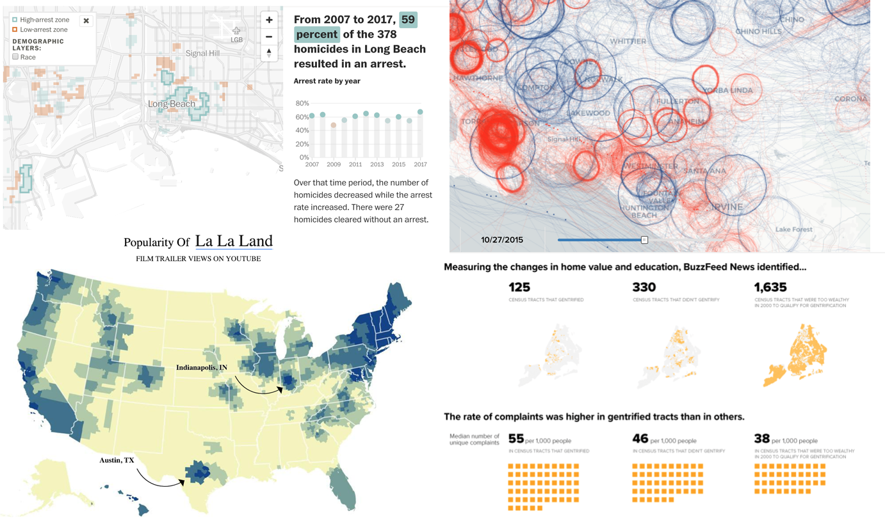
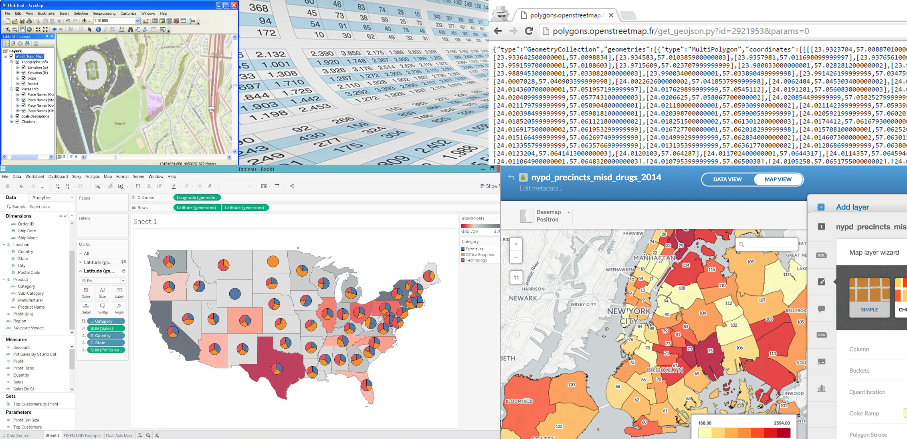
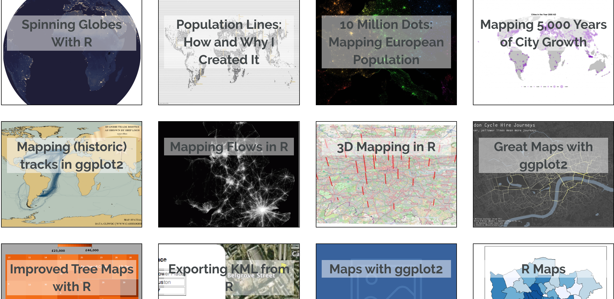
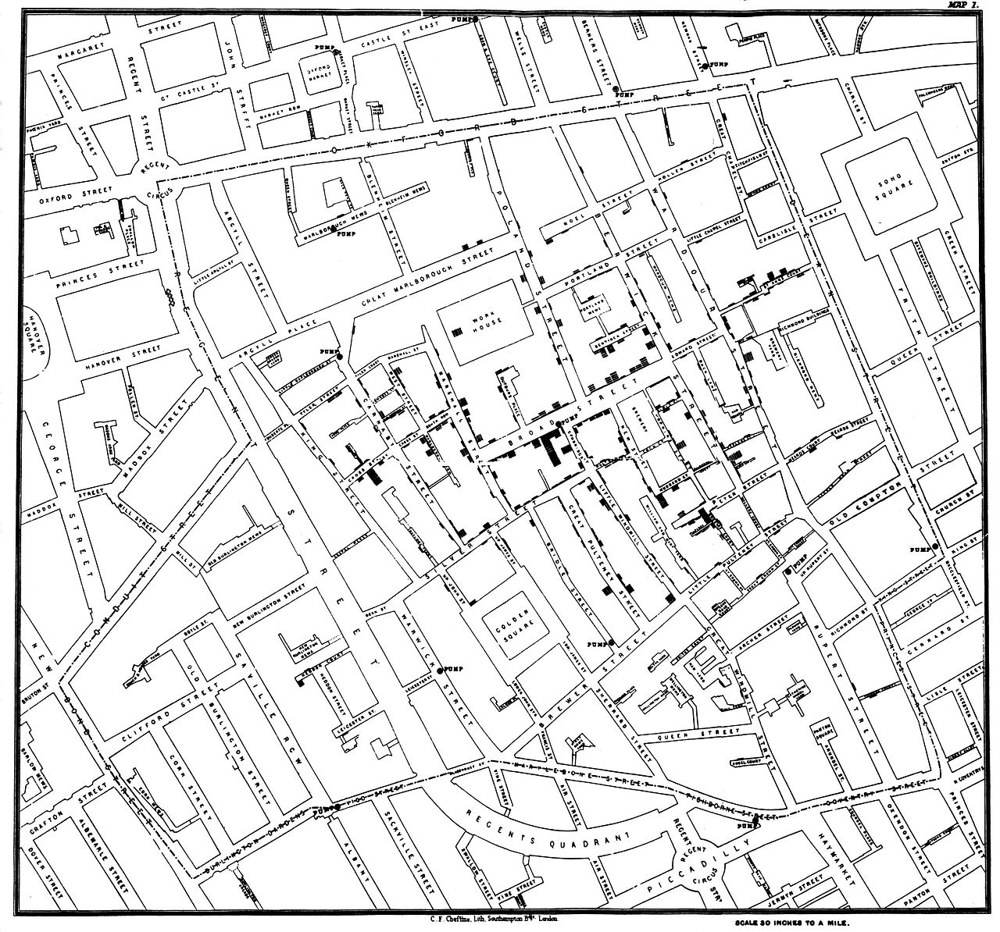
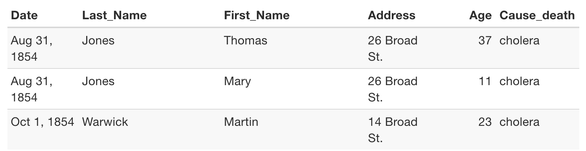
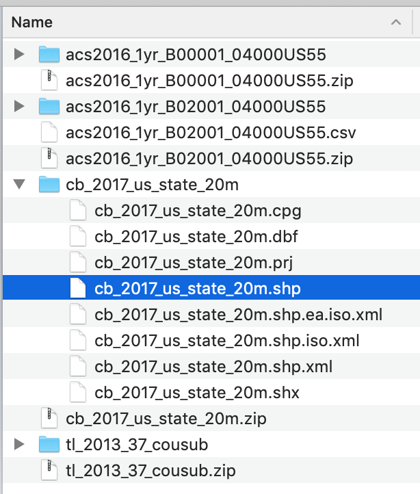
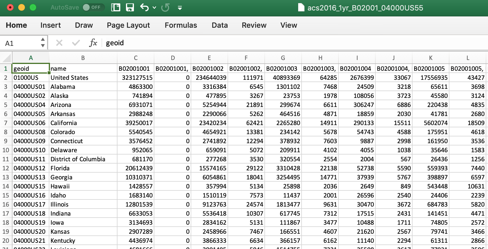
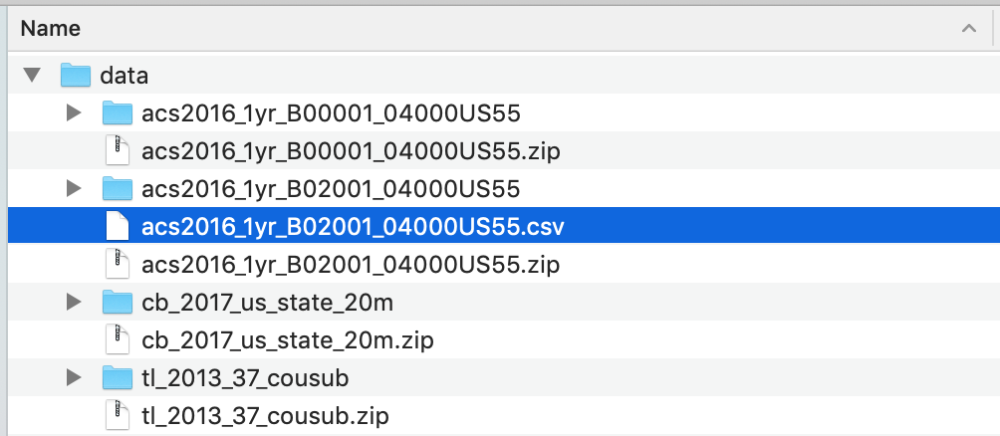
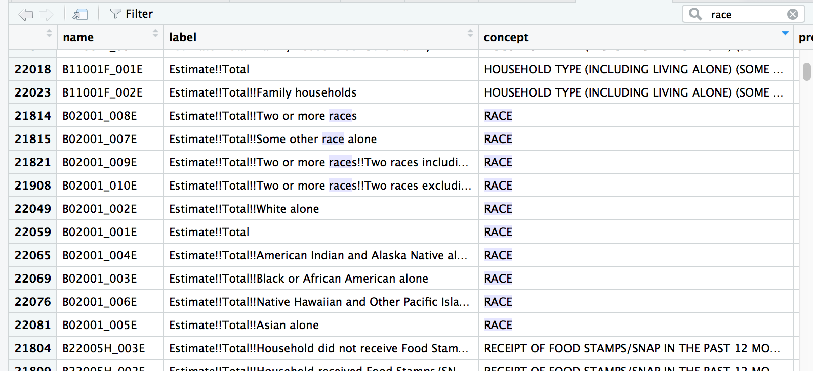

## Maps are fun


## Maps normally



1. **Download data and transform data**
    * Excel
2. **Find and download shapefiles**
    * Census TIGER
3. **Import maps and join with data and style**
    * ArcGIS or QGIS
4. **Export and tweak for style further**
    * Tableau, CartoDB, Illustrator


## Mapping with R



## Why map in R?

* Scripting and reproducibility
* Transparency and trust
* Easily interface with APIs for data and shapefiles
* Life is already complicated
    * Your process doesn't have to be

## Today

* Create static maps and interactive maps with geolocated data
* We’ll be using the more-recent packages in the R GIS community
    * simple features
    * leaflet
* Access the Census API to download data and use what we’ve already learned to join that data to shapefiles to make choropleth maps– both interactive and static.


## Basics

There are two underlying important pieces of information for spatial data:

* Coordinates of the object
* How the coordinates relate to a physical location on Earth
    * Also known as coordinate reference system or **CRS**

## CRS


* Geographic 
    * Uses three-dimensional model of the earth to define specific locations on the surface of the grid
    * longitude (East/West) and latitude (North/South)
* Projected
    * A translation of the three-dimensional grid onto a two-dimensional plane
    


## Raster versus Vector data

Spatial data with a defined CRS can either be vector or raster data.

* Vector
    * Based on points that can be connected to form lines and polygons
    * Located with in a coordinate reference system
    * Example: Road map
* Raster
    * Are values within a grid system
    * Example: Satellite imagery

## sf vs sp

* An older package, **sp**, lets a user handle both vector and raster data.
* This class will focus on vector data and the **sf** package. 


## Shape files

Though we refer to a shape file in the singular, it's actually a collection of at least three basic files: 

* .shp - lists shape and vertices
* .shx - has index with offsets
* .dbf - relationship file between geometry and attributes (data)

All files must be present in the directory and named the same (except for the file extension) to import correctly.


## The plan

1. Introduce the basic mapping functions
2. Map blank shape file after downloading
3. Join downloaded Census data to blank shape file and map
4. Use **tidycensus** to download Census data via an API and the shape file all at once

Let's load the packages we need:

```{r loading, warning=F, message=F}

# Checking if the packages you need are installed -- if not, it will install for you
packages <- c("tidyverse", "stringr", "censusapi", "sf", "tidycensus", "ggspatial", "tigris")
if (length(setdiff(packages, rownames(installed.packages()))) > 0) {
  install.packages(setdiff(packages, rownames(installed.packages())), repos = "http://cran.us.r-project.org")  
}


library(tidyverse)
library(sf)
library(ggspatial)

# If you're using a Mac, you may want to uncomment and run the lines below
# It makes loading maps more efficient
# If you get a warning or error, don't worry about it
#options(device = "X11") 
#X11.options(type = "cairo")
```

## Mapping a familiar shape file

**st_read()** is the function to import the shapefile.

Type out the code below or copy and paste it into the console or run Chunk1 from the XXXXX.rmd file

```{r old_school1}
map_layer1 <- st_read("map_shapes/cases.shp")

glimpse(map_layer1)
```

What does it look like when visualized?

We use the same visualization functions as ggplot2.

This time, the geom is geom_sf, though.

```{r old_school2}
ggplot(map_layer1) +
  geom_sf(aes(geometry=geometry, size=Count))
```
Does this look familiar at all?

What if we layer on another shape file?

```{r old_school3}
map_layer2 <- st_read("map_shapes/pumps.shp")

#  geom_sf(map_layer1, aes(geometry=geometry, size=Count)) +
ggplot(map_layer1) +
  geom_sf(aes(geometry=geometry, size=Count)) +
  geom_sf(data=map_layer2, aes(size = 3, color = "red")) 
```

Any guesses yet?

Alright, let's try one more thing:

```{r old_school4}
ggplot(map_layer1) +
    annotation_map_tile(type = "osm", zoomin = 0) + 
  geom_sf(aes(geometry=geometry, size=Count), alpha = 0.7) +
  geom_sf(data=map_layer2, aes(size = 3, color = "red")) +
  theme_void()
```
Alright, now it's more obvious, right?

...



This is the hypothetical data John Snow was working with.




## Mapping a simple shape file

We'll start by importing in a shape file of state boundaries from the [Census](https://www.census.gov/geo/maps-data/data/tiger-cart-boundary.html). These Census files are in your data folder.




```{r simple_states}
fifty_location <- "data/cb_2017_us_state_20m/cb_2017_us_state_20m.shp"
fifty_states <- st_read(fifty_location)

glimpse(fifty_states)
```


## Map fifty_states

Map with ggplot2 functions and **geom_sf**

```{r plot_fifty_simple, fig.width=9, fig.height=5, echo=T}
ggplot(fifty_states) + geom_sf()
```


## Join it to data 

Let's pull in population data from [CensusReporter.org](https://censusreporter.org/data/table/?table=B02001&geo_ids=040|01000US)



## Import the data

I've already downloaded and unzipped the file from the site:



Using **read_csv()** from the **readr** package.

```{r import_pop_csv, warning=F, message=F, echo=T}
# If you don't have readr installed yet, uncomment and run the line below
#install.packages("readr")

library(readr)
populations <- read_csv("data/acs2016_1yr_B02001_04000US55.csv")

populations
```


## Join data to blank shapefile and map

```{r join_data1, warning=F, message=F, echo=T}
ncol(fifty_states)

library(dplyr)

fifty_states <- left_join(fifty_states, populations,
                          by=c("NAME"="name"))
glimpse(fifty_states)
```

## What are the variables


* **STATEFP** is the state fips code. 
    * That stands for the Federal Information Processing Standard. It's a standardized way to identify states, counties, census tracts, etc.
* **GEOID** is also part of the fips code. 
    * In this instance it's only two digits wide. 
    * The more specific you get into the Census boundaries, the longer the number gets.
    
## What are the variables
   
* **B02001001**, **B02001002**, etc.
    * This is reference to a Census table of information.
    * For example, [**B02001001**](https://www.socialexplorer.com/data/ACS2016_5yr/metadata/?ds=ACS16_5yr&var=B02001001) is total population for that polygon of data in that row
    * When you export data from the Census, the variables get translated to this sort of format
    * You'll have to remember when you download it or [look it up](https://www.census.gov/programs-surveys/acs/guidance/which-data-tool/table-ids-explained.html).
* **B02001001, Error**
    * Margin of error included because these are just estimates, after all
* **geometry** 
    * This is the CRS data
    
## Map with the new data

* Map with `geom_sf()`
* Fill with **B02001001**
* Leave out Hawaii and Alaska for now


```{r joined_map, fig.width=9, fig.height=5}
forty_eight <- fifty_states %>% 
  filter(NAME!="Hawaii" & NAME!="Alaska" & NAME!="Puerto Rico")


ggplot(forty_eight) +
  geom_sf(aes(fill=B02001001)) +
  scale_fill_distiller(direction=1, name="Population") +
  labs(title="Population of 48 states", caption="Source: US Census")
```

* **%>%** and **filter**
* **ggplot()**
* **geom_sf()** and **aes()** and the **fill** variable
* **scale_fill_distiller() ** and the **direction** and **name** variables
* **labs()** and **title** and **caption** variables


## Downloading shape files directly into R

Using the [**tigris**](https://github.com/walkerke/tigris) package, which lets us download [Census shapefiles](https://www.census.gov/geo/maps-data/data/tiger-line.html) directly into R without having to unzip and point to directories, etc. 

Simply call any of these functions (with the proper location variables):

* `tracts()`
* `counties()`
* `school_districts()`
* `roads()`

## Downloading California

First, let's make sure the shape files download as **sf** files (because it can also handle **sp** versions, as well)

If **cb** is set to TRUE, it downloads a generalized (1:500k) counties file. Default is FALSE (the most detailed TIGER file).

```{r tigris_install, warning=F, message=F, quietly=T}
# If you don't have tigris installed yet, uncomment the line below and run
#install.packages("tigris")

library(tigris)

# Set map cache to true
options(tigris_use_cache = TRUE)

# set sf option

options(tigris_class = "sf")

ca <- counties("CA", cb=T)

#If cb is set to TRUE, download a generalized (1:500k) counties file. Defaults to FALSE (the most detailed TIGER file).

# tx <- readRDS("backup_data/tx.rds")

```

## What the ca object looks like

```{r ca}
glimpse(ca)
```

Looks familiar, right?

Same structure as the file we loaded from our local drive.

## Mapping California

```{r tigris_map, warning=F, message=F, quietly=T, echo=T}
ggplot(ca) + 
  geom_sf() +
  theme_void() +
  theme(panel.grid.major = element_line(colour = 'transparent')) +
  labs(title="California counties")
```

### YOUR TURN

Try this again with one of those [other map types](https://github.com/walkerke/tigris) from the Census

* `tracts()`
* `places()`
* `school_districts()`
* `roads()`

```{r tigris_map_custom, warning=F, message=F, quietly=T, echo=T, eval=F}

ca_test <- ______("CA", cb=T)

ggplot(ca_test) + 
  geom_sf() +
  theme_void() +
  theme(panel.grid.major = element_line(colour = 'transparent')) +
  labs(title="California counties")
```

## Notes on some code

```
  theme_void() +
  theme(panel.grid.major = element_line(colour = 'transparent')) +
```

* **theme_void()** is a special function that gets rid of grids and gray space for maps
* **theme()** is how you can alter specific styles of the visualization
* **theme_void()** is a collection of individual **theme()** modifications

Time to add some data


## Downloading Census data into R via API

Instead of downloading data from the horrible-to-navigate Census [FactFinder](https://factfinder.census.gov/faces/nav/jsf/pages/index.xhtml) or pleasant-to-navigate [CensusReporter.org](https://censusreporter.org/) we can pull the code with the [**censusapi** package](https://hrecht.github.io/censusapi/articles/getting-started.html) from Hannah Recht, of Bloomberg.

First, sign up for a [census key](https://api.census.gov/data/key_signup.html) and load it into the environment.

## Load the censusapi library

Replace YOURKEYHERE with your Census API key.

```{r census_key, eval=F}
# Add key to .Renviron
Sys.setenv(CENSUS_KEY="YOURKEYHERE")
# Reload .Renviron
readRenviron("~/.Renviron")
# Check to see that the expected key is output in your R console
Sys.getenv("CENSUS_KEY")
```

```{r load_censusapi, warning=F, message=F, echo=T}
# If you don't have censusapi installed yet, uncomment the line below and run
#install.packages("censusapi")

library(censusapi)
```


## Look up Census tables

Check out the dozens of data sets you have access to now.

```
# This isn't runnable as a chunk because it sometimes takes a very long time to load
# If you want to take a chance during this class, copy and paste and run in the console

apis <- listCensusApis()
View(apis)
```

## Downloading Census data

We'll focus on using the `getCensus()` function form the package. It makes an API call and returns a data frame of results.

These are the arguments you'll need to pass it:

* `name` - the name of the Census data set, like "acs5" or "timeseries/bds/firms"
* `vintage` - the year of the data set
* `vars` - one or more variables to access (remember *B02001001* from above?)
* `region` - the geography level of data, like county or tracts or state


## Get Census metadata

**Please don't run this right now.**

You can use `listCensusMetadata()` to see what tables might be available from the ACS Census survey.

```
acs_vars <- listCensusMetadata(name="acs/acs5", type="variables", vintage=2016)

View(acs_vars)
```




## Downloading median income

Note: We need to look up what the FIPS code is for California:
#https://www.nrcs.usda.gov/wps/portal/nrcs/detail/?cid=nrcs143_013696

Looks like it's "06"

```{r median_income, warning=F, message=F, echo=T}
ca_income <- getCensus(name = "acs/acs5", vintage = 2018, 
    vars = c("NAME", "B19013_001E", "B19013_001M"), 
    region = "county:*", regionin = "state:06")

head(ca_income)
```


## Join and map

```{r, ca_income, warning=F, message=F}
# Can't join by NAME because ca_income data frame has "County, California" at the end
# We could gsub out the string but we'll join on where there's already a consistent variable, even though the names don't line up

ca_map <- left_join(ca, ca_income, by=c("COUNTYFP"="county"))

ggplot(ca_map) + 
  geom_sf(aes(fill=B19013_001E), color="white") +
  theme_void() +
  theme(panel.grid.major = element_line(colour = 'transparent')) +
  scale_fill_distiller(palette="Oranges", direction=1, name="Median income") +
  labs(title="2018 Median income in California counties", caption="Source: US Census/ACS5 2018")
```


## Download Census data and shapefiles together

Newest package for Census data: [**tidycensus**]((https://walkerke.github.io/tidycensus/index.html))

With **tidycensus**, you can download the shape files with the data you want already attached. No joins necessary. 

Let's get right into mapping. We'll calculate unemployment percents by Census tract in Los Angeles. It'll involve wrangling some data. But querying the data with `get_acs()` will be easy and so will getting the shape file by simply passing it `geometry=T`.


## Load up tidycensus


```{r tidycensus, warning=F, message=F, echo=T}
# if you don't have tidycensus installed yet, uncomment and run the line below

#install.packages("tidycensus")

library(tidycensus)

# Pass it the census key you set up before
```

```{r key}
# Pass it the census key you set up before

census_api_key("YOUR API KEY GOES HERE")
```


## Getting unmployment figures

```{r racejobvars, warning=F, message=F, quietly=T, echo=T}
jobs <- c(labor_force = "B23025_005E", 
              unemployed = "B23025_002E")

la <- get_acs(geography="tract", year=2018, 
                  variables= jobs, county = "Los Angeles", 
                  state="CA", geometry=T)

glimpse(la)
```


## Transforming and mapping the data

```{r unemployed_la, warning=F, message=F}
library(tidyr)

la %>% 
  mutate(variable=case_when(
    variable=="B23025_005" ~ "Unemployed",
    variable=="B23025_002" ~ "Workforce")) %>%
  select(-moe) %>% 
  spread(variable, estimate) %>% 
  mutate(percent_unemployed=round(Unemployed/Workforce*100,2)) %>% 
ggplot(aes(fill=percent_unemployed)) + 
  geom_sf(color="white", size=0.2) +
  theme_void() +
  theme(panel.grid.major = element_line(colour = 'transparent')) +
  scale_fill_distiller(palette="Reds", direction=1, name="Estimate") +
  labs(title="Percent unemployed in Los Angeles", caption="Source: US Census/ACS5 2016") +
  NULL
  
```

## YOUR TURN

Look up another county in whatever state you want and map it again.

```{r unemployed_new_county, warning=F, message=F, eval=F}
jobs <- c(labor_force = "B23025_005E", 
              unemployed = "B23025_002E")

county_unemployment <- get_acs(geography="tract", year=2018, 
                  variables= jobs, county = "_________", 
                  state="__", geometry=T)

county_unemployment %>% 
  mutate(variable=case_when(
    variable=="B23025_005" ~ "Unemployed",
    variable=="B23025_002" ~ "Workforce")) %>%
  select(-moe) %>% 
  spread(variable, estimate) %>% 
  mutate(percent_unemployed=round(Unemployed/Workforce*100,2)) %>% 
ggplot(aes(fill=percent_unemployed)) + 
  geom_sf(color="white", size=0.2) +
  theme_void() +
  theme(panel.grid.major = element_line(colour = 'transparent')) +
  scale_fill_distiller(palette="Reds", direction=1, name="Estimate") +
  labs(title="Percent unemployed in NAME OF NEW COUNTY", caption="Source: US Census/ACS5 2018") +
  NULL
  
```


## Faceting maps (Small multiples)


```{r facet, warning=F, message=F, quietly=T, echo=T}
racevars <- c(White = "B03002_003", 
              Black = "B03002_004", 
              Asian = "B03002_006",
              Hispanic = "B03002_012")

# This will take a while

county_race_pop <- get_acs(geography = "tract", variables = racevars, 
                  state = "CA", county = "Los Angeles County", geometry = TRUE,
                  summary_var = "B03002_001", year=2017) 

county_race_pop

```


## Transforming and mapping the data

```{r faceting, warning=F, message=F}
library(viridis)

county_race_pop %>%
  mutate(pct = 100 * (estimate / summary_est)) %>%
  ggplot(aes(fill = pct, color = pct)) +
  facet_wrap(~variable) +
  geom_sf() +
  coord_sf(crs = 26915) + 
  scale_fill_viridis(direction=-1) +
  scale_color_viridis(direction=-1) +
  theme_void() +
  theme(panel.grid.major = element_line(colour = 'transparent')) +
  labs(title="Racial geography of Los Angeles County", caption="Source: US Census/ACS5 2018")
```

## YOUR TURN

Try it with a county in a state of your choice:

```{r facet2, warning=F, message=F, quietly=T, echo=T, eval=F}
racevars <- c(White = "B03002_003", 
              Black = "B03002_004", 
              Asian = "B03002_006",
              Hispanic = "B03002_012")

# This will take a while

county_race_pop <- get_acs(geography = "tract", variables = racevars, 
                  state = "__", county = "_______", geometry = TRUE,
                  summary_var = "B03002_001", year=2017) 

county_race_pop %>%
  mutate(pct = 100 * (estimate / summary_est)) %>%
  ggplot(aes(fill = pct, color = pct)) +
  facet_wrap(~variable) +
  geom_sf() +
  coord_sf(crs = 26915) + 
  scale_fill_viridis(direction=-1) +
  scale_color_viridis(direction=-1) +
  theme_void() +
  theme(panel.grid.major = element_line(colour = 'transparent')) +
  labs(title="Racial geography of NEW County", caption="Source: US Census/ACS5 2018")

```


## *About Alaska and Hawaii

If you pass `shift_geo=T` to the `get_acs()` function in **tidycensus** then the states will be re positioned.

## Welcome back Alaska and Hawaii

```{r alaska_hawii, warning=F, message=F, quietly=T}
county_pov <- get_acs(geography = "county",
                      variables = "B17001_002",
                      summary_var = "B17001_001",
                      geometry = TRUE,
                      shift_geo = TRUE) %>% 
  mutate(pctpov = 100 * (estimate/summary_est))

ggplot(county_pov) +
  geom_sf(aes(fill = pctpov), color=NA) +
  coord_sf(datum=NA) +
  labs(title = "Percent of population in poverty by county",
       subtitle = "Alaska and Hawaii are shifted and not to scale",
       caption = "Source: ACS 5-year, 2016",
       fill = "% in poverty") +
  scale_fill_viridis(direction=-1)
```

## New options

* tigris
* censusapi
* tidycensus
* tmap
* urbnmapr (via Urban Institute)

### Interactive maps

Want to make interactive maps with R?

Here's a class you can follow that I put together [for NICAR](https://nicar.r-journalism.com/docs/)

## Newer options

[**Mapdeck**](https://symbolixau.github.io/mapdeck/articles/layers.html)


## Newer options

[**Rayshader**](https://www.rayshader.com/)

