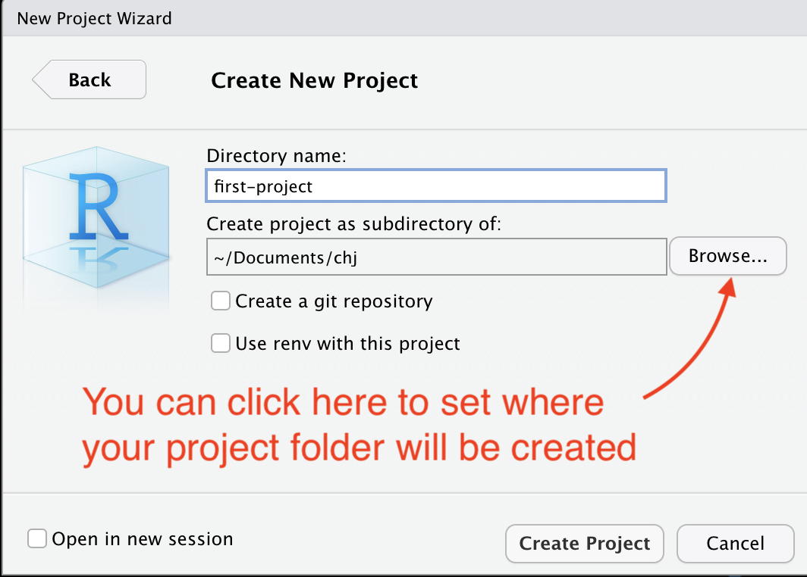

```{r setup, include=FALSE}
library(tidyverse)
library(janitor)
library(learnr)
knitr::opts_chunk$set(echo = FALSE)
```


## About these lessons

This lesson was written by Christian McDonald. I use a Mac so any keyboard commands that are *Cmd+whatever* might be *Ctrl+whatever* on a PC.

As we go through this week of training, we will use interactive tutorials like this one to describe and practice key concepts and then provide directions on how you can practice similar steps on your own computer.

During some practice sessions, we may ask half of the class to join a separate Zoom breakout room so that Andrew and Christian can help within smaller groups. When we are done with the practice period, we'll all return to the main R Teaching room. (When you leave the practice breakout you will return to the main fellowship session and will then need to re-join the R Teaching room.)

Here is an example interactive code block where you can write R code directly in the browser and run it. R is a programming language that allows you to do simple math, with common operators like `+`, `-`, `*` and `\`.

### Exercise 

*Here's a simple exercise with an empty code chunk provided for entering the answer.*

Write the R code required to add two plus two. Use the **Hint** button if you need it:

```{r two-plus-two, exercise=TRUE}

```

```{r two-plus-two-hint}
2 + 2
```

You'll see once you put in the answer and click **Run code** the executed answer will appear below the code chunk.

## Learning RStudio

This first day -- only an hour, really -- we'll be learning about RStudio, RMarkdown and how to use them. It's a lot of setup and not a lot of practice. I promise we'll get to the data quickly in future sessions.

### Create a chj folder for your work

Before we even launch RStudio, I would like you to create a folder on your computer called `chj` in some place you can find it later, like in your `Documents` folder. Each new data project will have its own folder, and it would be ideal if you could create those for this class inside your `chj` folder. That way we are all on the same page.

> Break for a minute to allow folder creation.

### What is R vs RStudio

While R and RStudio are technically two programs installed on your computer, you will only really launch and use RStudio. R is the programming language, and RStudio is an IDE (Integrated Development Environment) -- which is essentially a fancy code editor -- developed specifically for R programming.

There are two main ways to write an R program, either in an R script (files with a `.R` ending) or as an RNotebook (which has an `.Rmd` ending because it is written in RMarkdown.) We like using **RNotebooks** because we can interweave our code chunks with text explaining what we are tying to do. This is important as journalists because we want to be transparent about our work. It also helps us remember what the heck we were doing three weeks ago when we last used our code. *Remember, the most important audience of your code is your future self!*

### Launching RStudio

- Go ahead and launch RStudio if you haven't already.

When you launch RStudio, you will get a screen like this:

{width="90%"}

### Updating preferences

There are some preferences in RStudio that I would like you to change. By default, the program wants to save the state of your work (all the variables and such) when you close a project, but that is not good practice. We'll change that.

- Go to the **RStudio** menu and choose **Preferences**
- Under the **General** tab, uncheck the first four boxes.
- On the option "Save Workspace to .Rdata on exit", change that to **Never**.
- Click *OK* to close the box.

{width="90%"}

We only have to do this once for each computer.

### Starting a new Project

When we work in RStudio, we will create "Projects" to hold all the files related to one another. This sets the "working directory", which is a sort of home base for the project.

- In the top toolbar for RStudio, click on the second button that has a green `+R` sign.
- That brings up a box to create the project with several options. You want **New Directory** (unless you already have a folder for this specific project, which you don't yet.)
- For **Project Type**, choose **New Project**.
- Next, for the **Directory name**, choose a new name for your project folder. For this project, use "first-project".
- For **Create project as a subdirectory of:** I want you to click on the **Browse** button and go find the `chj` folder you created earlier.

I am pretty anal-retentive about naming folders because they can become URLs in the future. It's a good programming habit.

- Use lowercase characters.
- Don't use spaces. Use dashes.

{width=90%}

When you hit **Create Project**, your RStudio window will refresh and you'll see the `first-project.Rproj` file in your Files list.


## Projects and RNotebooks

You should consider each R project as a self-contained unit. Each R session should run one project at a time. The `first-project.Rproj` file helps RStudio understand this one-project world. Every other file you need for your project should be stored inside your project folder.

For this class, we will almost always use R Notebooks. This format allows us to write text in between our blocks of code. The text is written in a language called [R Markdown](https://rmarkdown.rstudio.com/lesson-1.html), a juiced-up version of the common documentation syntax used by programmers, Markdown. It's not hard to learn.

### Create your first notebook

- Click on the button at the top-left of RStudio that has just the green `+` sign with a document behind it.
- Choose the item **R Notebook**.

This will open a new file with some boilerplate R Markdown code.

{width="90%"}

- At the top between the `---` marks, is the **metadata**. This is written using YAML, and what is inside are commands for the RNotebook. Don't sweat the YAML syntax too much right now, as we won't be editing it often.
- Next, you'll see a couple of paragraphs of text that describe how to use an RNotebooks. It is written in R Markdown, and has some inline links and bold commands, which you will learn.
- Then you will see an R code chunk.

Let's take a closer look at this chunk part:

- The three back-tick characters (the key found at the top left on your keyboard) followed by the `{r}` indicate that this is a chunk of R code. The last three back ticks say the code chunk is over.
- The `{r}` bit can have some parameters added to it. We'll get into that later.
- The line `plot(cars)` is R programming code. We'll see what that commands does in a bit.
- The green right-arrow to the far right is a play button to run the code that is inside the chunk.
- The green down-arrow and bar to the left of that runs all the code in the Notebook up to that point.
- The hard-to-see gear to the left of that allows you to set code chunk options. We probaby won't use that much here.

### Save the .Rmd file

- Do *Cmd+s* or hit the floppy disk icon to save the file.
- It will ask you what you want to name this file. Call it `01-first-file.Rmd`. RStudio should already be saving this file inside your project folder.

> We named this file with `01-` at the beginning because we'll often have multiple notebooks in a project that should be run in order. Data created from one notebook might be used in another. Using this convention lets us know what order to run the notebooks.

When you do this, you may see another new file created in your Files directory with an `.html` ending. It's the pretty version of the notebook which we'll see in a minute.

In the YAML metadata portion of the file, give your notebook a better title.

- Replace "R Notebook" in the `title: "R Notebook"` code to be "Christian's first notebook", but use your name.

### Run the notebook

There is only one chunk to run in this notebook, so:

- Click on the green right-arrow to run the code.

You should get something like this:

{width="90%"}

What you've done here is create a plot chart of the sample data "cars" that is already embedded inside the R programming language. (FWIW, it is the speed of cars and the distances taken to stop, but note the data were recorded in the 1920s.) There are other data sets like this embedded in R for examples like this.

But that wasn't a whole lot of code to see there is a relationship with speed vs stopping distance, eh?

> Let's stop here to make sure everyone has gotten to this point.

### Adding new code chunks

The text after the chart describes how to insert a new code chunk. Let's do that.

- Add a couple of returns after the paragraph of text about code chunks, but before the next bit about previews.
- Use the keys *Cmd+Option+i* to add the chunk.
- Your cursor will be inserted into the middle of the chunk. Type in this code in the space provided:

```r
# update 53 to your age
age <- 53
(age - 7) * 2
```

- Change for "53" to your real age.
- With your cursor somewhere in the code block, use the key command *Cmd+Shift+Return*, which is the key command to RUN ALL LINES of code chunk.
- NOTE: To run an individual line, use *Cmd+Return* while on that line.

Congratulations! The answer given at the bottom of that code chunk is the [socially-acceptable maximum age of anyone you should date](https://www.psychologytoday.com/us/blog/meet-catch-and-keep/201405/who-is-too-young-or-too-old-you-date).

Throwing aside whether the formula is sound, let's break down the code.

- `# update 53 to your age` is a comment. It's a way to explain what is happening in the code without being considered part of the code. The hashtag at the beginning of the line makes it a comment.
- `age <- 53` is assigning a number (`53`) to a variable name (`age`). A variable is a placeholder. It can hold numbers, text or even groups of numbers. Variables are key to programming because they allow you to change a value as you go along. In R we use an arrow (or dash and angle bracket) to show which direction we are assigning the value, but convention is to name the variable first, then assign from the right.
- Pro tip: You can use *Option+-* (Option dash) to type in the `<-` assigning operator.
- The next part is simple math: `(age - 7) * 2` takes the value of `age` and subtracts `7`, then multiplies by `2`. You might have noticed that the editor helped you by adding closing `)` and putting your cursor in the middle. If you've never used a code editor, help like this can be confusing at first, but you'll learn to love it.
- When you run the code chucnk, you get the result of the math equation below it, `[1] 92` in my case. That means there was one observation, and the value was "92". For the record, my wife is _much_ younger than that.

Now you can play with the number assigned to the age variable to test out different ages. Do that.

> We'll break here to make sure everyone is good.

### A note on RMarkdown and clean code

When writing RMarkdown in an RNotebook, you want an empty blank line between each major element: code block, headline, or paragraph of text.

In the text, headlines are indicated with one or more hashtags at the beginning with a space before the words. The more hashtags there are, the smaller the headline (I know, it's counter-intuitive, but it matches HTML headlines.) In RNotebooks, the singe-hashtag headline is the title, so the next biggest headline you should use is two hashes:

```md

## This is the biggest headline you should add

This is text.

This is a new paragraph.

### A smaller headline as subhead to the one above

This text is related to the above in some way.
```

Also make sure you have blank lines above and below each code chunk.

### Preview the report

The rest of the boilerplate text here describes how you can *Preview* and *Knit* a notebook. Let's do that now.

- Press *Cmd+Shift+K* to open a Preview.

This will open a new window and show you the "pretty" notebook that we are building.

Preview is a little different than *Knit*, which runs all the code, then creates the new knitted HTML document. **Knit to HMTL** creates an HTML document that you can send to others, or publish on Github with some additional YAML configurations. You can also Knit to PDFs.

### The toolbar

One last thing to point out with RStudio before we move on is the toolbar that runs across the top of the RNotebook file window. The image below explains some of the more useful tools, but you _REALLY_ should learn and use keyboard commands when they are available.

{width=90%}

## The tidyverse and R packages

While "base" R is a robust programming language on its own, the true power lies in a community that writes "packages" to do new things easier and better. As R users, we "install" the code for these packages into RStudio to make their functions available to us.

The pièce de résistance of packages is the [tidyverse](https://www.tidyverse.org/), as collection of packages for data science that were all written to work together. Hadley Wickham is one of the main developers. He wrote the book [R for Data Science](https://r4ds.had.co.nz/index.html).

{width=90%}

### Install the tidyverse

Let's install the tidyverse on your machines.

- Open the **Console** at the bottom of your RStudio window.
- At the bottom after the `>` type in `install.packages("tidyverse")` and hit return.

You'll see your computer work away and eventually come to a success message saying where the packages were installed. You only have to do this once for your computer.

When we install packages, we put the package name in quotes because R doesn't "have" what it is looking for yet and has to look for it. When we "use" libraries later, we won't have the quotes.

### Install janitor and lubridate

There are two other packages we are going to install and we'll do it at one time, learning about `c()` along the way.

- In your **Console**, run:

`install.packages(c("janitor","lubridate"))`

[janitor](https://cran.r-project.org/web/packages/janitor/vignettes/janitor.html) has some data cleaning properties we'll use. [lubridate](https://lubridate.tidyverse.org/) makes dealing with dates and time values a little easier.

You'll note we used this `c("term1","term1")` construction to feed R a combination of items, which you'll see a lot. The `c` stands for **combine** and we use it to build collections of things we call **vectors**.

*BORING DETAILS:* [**Vectors**](https://www.tutorialspoint.com/r/r_vectors.htm) are collections of elements of like value, like numbers or strings of letters. Everything is a vector in R, really -- a single letter in R is a vector with a length of 1. I would say think of vectors like a list of common things, but a [list](https://www.tutorialspoint.com/r/r_lists.htm) is a special object of its own, a combination of unlike things.

### Using libraries

We're going to start our next RNotebook and set up some of these libraries.

- In the first top toolbar icon with the `+` and document, choose RNotebook.
- In the YAML at the top of the file, change the metadata **title** to "MN Opioid deaths" as that is what we'll be working with.
- Delete everything after the `---` on the 4th line.
- Save the file and name it **01-opioid-clean.Rmd**. (We named with `01-` since this is also the first in a series of notebooks that may work together.)
- Lastly, make sure you have a full blank line after the YAML metadata and add a new code chuck with *Cmd+Option+I*.

Inside this code chunk we are going to add the libraries we'll use for this next lesson:

```r
library(tidyverse)
library(janitor)
```

When you run that chunk of code, you might see this output in your Console:

```r
> library(tidyverse)
package ‘tidyverse’ was built under R version 4.0.2Registered S3 methods overwritten by 'dbplyr':
  method         from
  print.tbl_lazy     
  print.tbl_sql      
── Attaching packages ─────────────────────────────────────────────── tidyverse 1.3.0 ──
✓ ggplot2 3.3.1     ✓ purrr   0.3.4
✓ tibble  3.0.1     ✓ dplyr   1.0.0
✓ tidyr   1.1.0     ✓ stringr 1.4.0
✓ readr   1.3.1     ✓ forcats 0.5.0
── Conflicts ────────────────────────────────────────────────── tidyverse_conflicts() ──
x dplyr::filter() masks stats::filter()
x dplyr::lag()    masks stats::lag()
> library(janitor)

Attaching package: ‘janitor’

The following objects are masked from ‘package:stats’:

    chisq.test, fisher.test

```

This tells us that tidyverse is a series of packages. Sometimes packages overwrite base R functions. We are good with this.

## Importing data

OK, let's get to some data, shall we?

### Importing with readr

The tidyverse package [readr](https://readr.tidyverse.org/) (included in the tidyverse library) is our workhorse for importing and exporting of data. There are other tidyverse specialty packages for importing and working with data like [jsonlite](https://cran.r-project.org/web/packages/jsonlite/vignettes/json-aaquickstart.html) and [readxl]([readxl](https://readxl.tidyverse.org/reference/read_excel.html)) and some alternatives like  [rio](https://www.rdocumentation.org/packages/rio/).

Instead of downloading a file to your computer and then importing it, we'll save some time by importing data saved internet as a comma separated value (CSV) file.

Let's **practice this first in the tutorial here** so you see how it works, then we'll practice again in a bit within your own project on your computer.

The code below shows the `read_csv` function and runs it so you can see the data.

```{r opioid-read, exercise=TRUE, exercise.eval=TRUE}
read_csv("https://github.com/utdata/chj-r-introduction/blob/main/data/chj_mn_opiate_deaths_data.csv?raw=true")
```

When we use `read_csv()` and give it a path (in quotes), R will print the result below the R chunk. You can click on the arrows and page navigation to peek through the data.

But that is all it did ... print to our screen. For us to be able to use this data later, we need to assign it to an R object. A table like this in R is called a **data frame** (or **tibble** as they are known in the tidyverse, but we still call them data frames). We use the `<-` assignment operator to assign the data to the object, which we name ourselves.

We are going to assign the result of the `read_csv()` command into an object called `deaths`. We do the operation from right-to-left, so start we start with the newly-named object, and then "fill" it with the data. This takes a bit getting used to, but it makes for readable code down the line. Go ahead and run the code and then we'll talk about it.


```{r opioid-assign, exercise=TRUE, exercise.eval=TRUE}
# read and assign the data
deaths <- read_csv("https://github.com/utdata/chj-r-introduction/blob/main/data/chj_mn_opiate_deaths_data.csv?raw=true")

# peek at deaths
deaths
```

The first line of code is the assigning to our data to the data frame called `deaths`. Since that operation isn't printing anything to our screen we add another line with the name of the data frame `deaths` so we can peek at it.

### Cleaning up names

One thing you might notice is some of the column names are two words. While it is possible to keep working this way, it is much easier if all our column names are lowercase and multi-word names are connected with underscores `_`.

In the process of cleaning these names with the janitor function called `clean_names()` we'll also learn about the tidyverse pipe ` %>% `.

```{r prep-deaths, include=FALSE}
deaths <- read_csv("https://github.com/utdata/chj-r-introduction/blob/main/data/chj_mn_opiate_deaths_data.csv?raw=true")
```

```{r opioid-clean, exercise=TRUE, exercise.setup="prep-deaths"}
# Assumes csv has been imported and assigned to deaths

# clean the names and then reassign
deaths <- deaths %>%
  clean_names()

# peek at the top of the updated data frame with head()
deaths %>%
  head()
```

### The tidyverse pipe

One of the tenets of the tidyverse is the use of the pipe ` %>% ` which takes the result of the previous operation and "pipes" it into the next operation. It makes for more readable code than the nested syntax of base R, so much so I don't even teach nesting.

When we see the pipe, think of the term "and then". We are starting with the `deaths` data frame **and then** limiting that result to just the `head()` of data frame.  If you put a number inside the parenthesis, like `head(20)` then it will give you that many lines. Try it and run the code again.

A couple of things about the pipe:

- The `%>%` has to be on the same line as the data it receives.
- In complicated strings of code, you can add a return *after* the pipe, then the next line will be indented to indicate it is a continuation. So you'll often see a pipe at the end of a line, like in our examples above.
- In RStudio you can use the keyboard command *Cmd+shift+m* type the pipe. Unfortunately keyboard commands don't work inside the online tutorials.

### Update your project with deaths

Take a moment to go into your own `01-opioid-deaths.Rmd` RNotebook and add a code chuck (*Cmd+Option+I*) and *type* the code example from above into it and run it. (I ask that you type the code instead of copy/paste so you can get used to using *Cmd+shift+m* for the pipe and *Cmd+-* for the assigning operaror. You'll also make mistakes and have to fix them. It helps the learning process.)

Above the code chunk, write text in your own words to describe what is happening in the code chunk. These kind of annotations are as important to your future self as anyone else.

When you assign the data to the `deaths` data frame, you'll notice that the object shows up in your **Environment** tab at the top right of RStudio. Any object you create is "saved" into the environment to use later.

{width=60%}

> Take a break here to let everyone catch up.

## Exploring data

OK, now we have data imported, but what is in it? One way to get a quick look at the field names and data types is with `summary()`. We'll again use our pipe, though on one line. (These examples assume `deaths` is already in your environment.)

```{r prep-explore, include=FALSE}
deaths <- read_csv("https://github.com/utdata/chj-r-introduction/blob/main/data/chj_mn_opiate_deaths_data.csv?raw=true")
```


```{r explore-summary, exercise=T, exercise.setup = "prep-explore"}
deaths %>% summary()
```

For each column you'll see the data type (which is an important lesson for tomorrow) and some other data. Look specifically at `age_years` which is a number data type. The summary gives you some basic stats about the collection of numbers in that column.

One thing `summary()` is useful for is to see if all your data types are correct. If you browse through this list and the head of the data from the code block above, is there anything out of whack? Are all the numbers really numbers? Are the dates really dates?

Another handy way to look at your data is through `glimpse()`. This shows you the names, the data type and some examples from the data, all in one.

```{r explore-glimpse, exercise=T, exercise.setup = "prep-explore"}
deaths %>% glimpse()
```

With this look, we can see we have `birth_date` and `death_date` which are stored as <chr> (text) instead of a real date datatype. We'll fix that in the Day 2 lesson.

## Getting help

We have used a ton of R "verbs" as we call the functions ... probably too many to remember, and there are more to come. Let's talk briefly about how you can get help with how things work in R.

One way is through the built-in **Help** function within RStudio. If you look at the pane at the bottom-right of RStudio, you'll see tabs for "Files", "Plots", "Packages" and "Help". Click on the **Help* tab.

You can type in a function or part of a function and get a list of items. If you search for "glimpse" you'll see two returns, and you can click on the link for **tibble::glimpse** to get more information about how to use the function with some examples toward the bottom.

{width=60%}

### Good Googling

Another way to get help is to Google for it, but that can be an art, especially there are other data science languates and programs with similar terms as R. It helps to use "in R". Some other tips:

- Use "in R" in your search: *How to merge data frames in R*
- Use the name of the package *if you now it: Add labels with ggplot*
- Use "tidyverse" if appropriate: *convert text to date with tidyverse*

There are plenty of StackOverflow answers along with different tutorials from blogs and such. It is a well-used language, so there are lots of answers to help. Too many, sometimes.

### Tidyverse docs and cheatsheets

It is worth becoming familiar with the [tidyverse](https://www.tidyverse.org/) site. Click on each icon from the home page to learn what each package does. R is also big on [cheatsheets](https://rstudio.com/resources/cheatsheets/), which are printable pages that go through all the verbs. They can be a bit much at first, but useful once you use R more.

We'll try to put together a list of other resources and tutorials. You can find some [I've collected already here](https://docs.google.com/document/d/1slMdrTLfxYt0mZO1G_Wlz1cOcGjCdgiJr7wzpcU9n1Y/edit?usp=sharing).

---

We'll end here for today.

